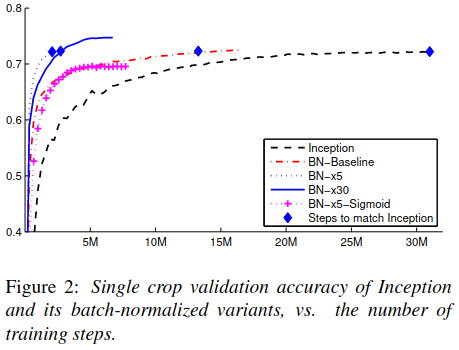

# Batch Normalization

## 論文について (掲載ジャーナルなど)
- [Ioffe, S., & Szegedy, C. (2015, June). Batch normalization:  Accelerating deep network training by reducing internal covariate shift. In *International conference on machine learning* (pp. 448-456). PMLR.](https://arxiv.org/abs/1502.03167)
  - このメモではBatch NormalizationをBNと呼称

## 概要
- ディープニュラルネットワークでは、前のレイヤのパラメータが変化するとトレーニング中に各レイヤーの入力の分布が変化し、ネットワークの学習が超困難
- 学習中の各ミニバッチごとに正規化（←やってることは標準化＋αでは…？）することで、↑の問題を解決
- BNのメリット
  - 学習率を高くできる
  - パラメータの初期値に敏感でなくなる
  - ドロップアウトが必要なくなる

## 問題設定と解決したこと
- ディープニューラルネットワークの学習では、前の層のパラメータが変化すると、そのあとの各層の入力の分布が学習中に変化→学習が困難になる
  - 学習率をさげたり、パラメータの初期化を慎重に行うことで対策するが、これにより学習が遅くなる問題がが

- 学習時にミニバッチごとに層の入力を正規化する*Batch Normalization*を導入
- BNで解決したこと
  - 学習率を高くできる→学習を高速化
  - パラメータの初期値を慎重に設定しなくても学習可能になる
  - 正則化としても機能する（場合によってはドロップアウトが必要なくなる）
- 画像認識モデルにBNを追加するだけで学習速度が大幅に向上
  - シングルネットワークの画像分類の当時のSOTAになった

## 何をどう使ったのか
- バッチ内でチャンネルごとに*BN*（ややこしい）
  - あるカーネルで処理した**カタマリ**ごとに正規化しないと意味ないよね！
  - ミニバッチごとに正規化を行い、正規化パラメータを介して勾配をバックプロパゲーションする
    - 活性化ごとに2つのパラメータを追加するだけで、ネットワークの表現力を維持

- ミニバッチにおける諸々
  - ミニバッチにおける損失の勾配は、学習データ全体における勾配の推定値→バッチサイズ大＝勾配の推定の品質大
  - 近年のコンピュータは並列演算が可能→個々の例に対するm回の計算よりも、バッチに対する計算のほうが効率的

## 主張の有効性の検証方法
- 以下の条件で検証

  - データセット：ImageNet
  - モデル：Inception

- BNありは、BNなしよりも学習ステップが大幅に少なくなり、Accuracyも上昇

  - 学習率が同じBN-baseではステップ数が半分程度
  - 学習率を5倍にしたBN-x5でステップ数がもとの6.7%まで減少
  - 学習率を30倍にしたBN-x30では、ステップ数がもとの8.7%まで減少し正解率がBNなしよりも2%ポイント上昇

## 批評
- 内部共変量シフトが起こらなくなると論文内では主張しているが、**そうではない**ことが後の論文で明らかになった。
- RNNに適用すると、勾配消失/爆発がもっと酷くなる可能性が…？
  - そのための Layer Normalization

## 次に読むべき論文
- Santurkar, S., Tsipras, D., Ilyas, A., & Mądry, A. (2018, December). How does batch normalization help optimization?. In *Proceedings of the 32nd international conference on neural information processing systems* (pp. 2488-2498).
