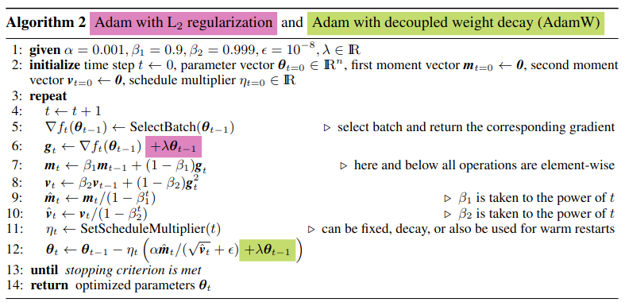

# Decoupled Weight Decay Regularization

## 論文について (掲載ジャーナルなど)
- [Loshchilov, I., & Hutter, F. (2017). Decoupled weight decay regularization. *arXiv preprint arXiv:1711.05101*.](https://arxiv.org/pdf/1711.05101.pdf)

## 概要
- SGDでは$L^2$正則化とweight decay正則化は等価
- Adamのような適応的勾配アルゴリズムでは等価**ではない**
  - Adamの weight decay の実装、どのフレームワークでも間違ってないか？という問題提起

- Adamにおけるwight decayの項目を修正したAdamWを提案

## 問題設定と解決したこと
- 適応的勾配法 (Adaptive gradient methods) はいくつか提案されているが、一般的な画像分類データセットにたいするSOTA（2018年時）はmommentum SGD が使われる
  - 適応的勾配法の例：AdaGrad, RMSProp, Adam

- 問い「SGDとAdamを用いてニューラルネットワークを学習する際に、 $L_2$ 正則化と weight decay 正則化のどちらを使うのがベターなのか？」
  - 答え「修正した weight decay 正則化が◎」

- Adamを使って学習したときの汎化性能が低くなる主な要因は、**$L_2$ 正則化がSGDほど効果的ではない**こと起因することを示す
  - Adamにおけるweight decay正則化について詳細に分析したのでこれを報告する！

  - Adamにおいて、
    - $L_2$ 正則化と weight decay 正則化は同一ではない（SGDでは同一とみなせる）
    - $L_2$ 正則化は有効ではない
    - weight decay は効果がある（SGDでも効果的）
    - 最適な weight decay はバッチパス/ウェイトアップデートの総数に依存
      - 実行時間/実行されるバッチパス数が多いほど、最適なwight decayは小さくなる（経験的にいわれている）←アドホックだなぁ…
    - 学習率スケジューリング（cosine annealing など）は効果的（である可能性を排除しきれない）←データセット＋学習するモデルに過剰適合してんちゃうん

- SGDの$L_2$正則化とweight decayが等価であることを示す

  - 参考記事：[Weight Decay == L2 Regularization?](https://towardsdatascience.com/weight-decay-l2-regularization-90a9e17713cd)

  - $L_2$正則化による重みパラメータ$w$の更新量

    - $C$をクロスエントロピーコスト関数、$x_j$を$j$番目の入力データ、$y_j$を$j$番目の正解ラベル、$a^L_j$をレイヤー$L$における予想ラベル、$n$はデータの総数とする。

    $$
    C = -\frac{1}{n}\sum_{x_j}\left[ y_j \ln a^L_j + (1-y_j)\ln (1-a^L_j) \right]
    $$

    - $L_2$正則化をかけた場合、以下の式になる。$w$はネットワークの重みパラメータ、$\lambda$は正則化の強さを調整するハイパーパラメータ。

    $$
    C = -\frac{1}{n}\sum_{x_j}\left[ y_j \ln a^L_j + (1-y_j)\ln (1-a^L_j) \right]+\frac{\lambda}{2n}\sum_w w^2
    $$

    - 第一項を$C_0$とおく

    - $C$を$\omega$やバイアス$b$で偏微分しバックプロパゲーションすることで各パラメータの更新量がわかる

      - $$
        \begin{eqnarray}
        \frac{\partial C}{\partial w} &=& \frac{\partial C_0}{\partial w}+\frac{\lambda}{n}w \\
        \frac{\partial C}{\partial b} &=& \frac{\partial C_0}{\partial b}
        \end{eqnarray}
        $$

    - $\eta$を学習率とすると、バイアスと重みの更新ルールは

      - $$
        b \rightarrow b - \eta \frac{\partial C_0}{\partial b}\\
        w \rightarrow w - \eta \frac{\partial C_0}{\partial w} - \eta\frac{\lambda}{n}w=\left( 1- \frac{\eta\lambda}{n} \right)w - \eta\frac{\partial C_0}{\partial w}
        $$

    - これは、重み減衰率$\lambda^\prime=\frac{\eta\lambda}{n}$でweight decayをかけているのと等価

      - コスト関数$C$の**中**で重み$w$を調整するのが$L_2$正則化
      - コスト関数$C$の**外**で重み$w$を調整するのがwight decay

## 何をどう使ったのか
- main contribution
  - 勾配ベースの更新から weight decay を切り離すことで、Adamの正則化を改善したこと
  - 包括的な分析により、$L_2$ 正則化よりもdecoupled weight decay （非結合型の重み減衰）を使うことでAdamの汎化性能が大幅に向上したことを示したこと
  - 

## 主張の有効性の検証方法
- 

## 批評
- というか参考資料
  - [AdamW and Super-convergence is now the fastest way to train neural nets ](https://www.fast.ai/2018/07/02/adam-weight-decay/)
    - AdamWに関するfast.aiのブログ記事
    - 要約
      - **適切にチューニングされた**Adamは高精度に早く収束する
      - SGDからAdamに変更する場合は、正則化ハイパーパラメータを**必ず**調整すべし

  - [実務で使えるニューラルネットワークの最適化手法](https://acro-engineer.hatenablog.com/entry/2019/12/25/130000)
    - SGD, Adam, AdamW に加えて、AdaBound, RAdam の所感まで記載
      - （簡単だが）各Optimizerの性能をCIFAR10を使ってResNet-50を学習することで調査

    - RAdamが良さげだが…

## 次に読むべき論文
- [On Empirical Comparisons of Optimizers for Deep Learning](https://arxiv.org/pdf/1910.05446.pdf)
  - 網羅的に最適化手法の性能を比較した論文
  - Adamが他の最適化手法を包含しており性能が良くなりやすい
  - しかし、Adamは**ハイパーパラメータに敏感**でかなり広い範囲を探索しないと最高性能がだせない
    - パラメータによっては、SGDに負けることも…
