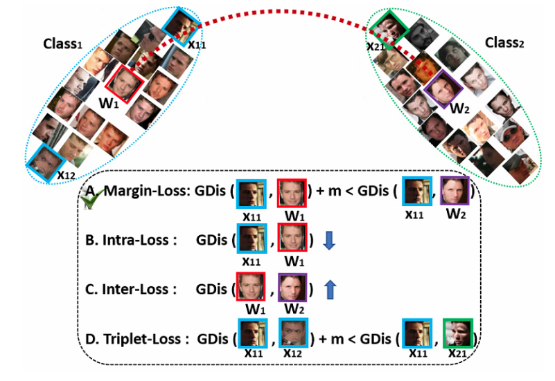
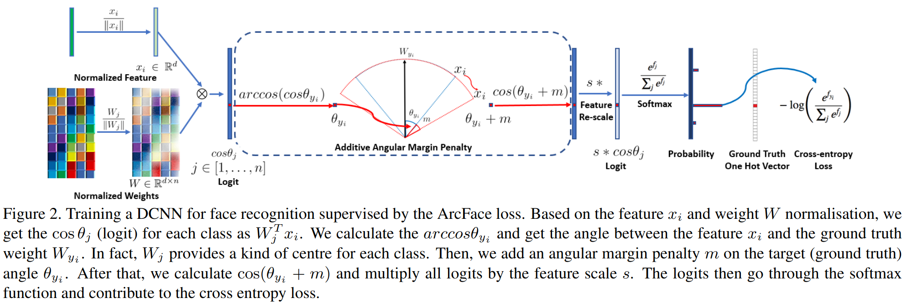

# ArcFace: Additive Angular Margin Loss for Deep Face Recognition

## 論文について (掲載ジャーナルなど)
- [Deng, J., Guo, J., Xue, N., & Zafeiriou, S. (2019). Arcface: Additive angular margin loss for deep face recognition. In *Proceedings of the IEEE/CVF conference on computer vision and pattern recognition* (pp. 4690-4699).](https://arxiv.org/pdf/1801.07698.pdf)

## 概要
- 顔認識のための高い識別性を持つ損失関数Additive Angular Margin Loss (ArcFace, ArcMarginLoss)を提案
    - 顔認識以外にも使われるけど
    - ArcFaceは、超球面上の測地線距離に対応するため、明確な幾何学的解釈を持つ
        - （数弱すぎて測地線距離わからん…）
        - Margin-Loss (GDis = 測地線距離)：
            「標本$X_{11}$とクラス1の中心$W_1$との測地線距離にマージン$m$を加えたもの」は
            「標本$X_{11}$とクラス2の中心$W_2$との測地線距離」よりも小さくなって欲しい
        - 論文の図1より引用←非常に分かりやすい
- 大規模な顔認識データベースを用いたベンチマークでSOTA

## 問題設定と解決したこと
- 背景（詳しくないので、細かく書く）
    - 顔認識では、CNN埋め込みを用いた”顔の表現”（特徴量）がよく用いられる
        - 顔画像→クラス内距離が小さくクラス間距離が大きい特徴量　にマッピング…ってコト！？

    - 顔認識のCNNを学習させる研究には、2つの系統が存在
        1.  学習データの中の異なるIDをseparateする多クラス分類機を学習
            -   softmax分類器
            -   -   

        2.  埋め込みを直接学習
            -   Triplet loss

    - しかし、softmax loss と triplet loss は欠点がある
        - softmax loss の欠点
            1.  線形変換行列$W\in \mathbb{R}^{d\times n}$のサイズが識別数$n$に対して線形に増加する点
            2.  学習された特徴は、クローズドな顔データ集合の分離問題に対しては分離可能だが、オープンな顔データの集合の顔認識問題に対しては十分に識別可能ではない点
                -   新しく入ってくる顔データは識別可能ではないかもってこと
                -   softmax lossの識別力を高めるために、いくつか改善がなされている
                    -   Sphereface, CosFace…
                    -   学習が不安定になるという問題も

        - triplet lossの欠点
            1.  大規模なデータセットにおいて、組み合わせ爆発がおこり、反復ステップ数がやばくなる点
            2.  効果的なモデルの学習にとって、semi-hard sample mining が困難
                -   もってくる標本を選ぶ問題
                -   分離境界面の近くってクラス1とクラス2が混ざったような形になるやろし

- 顔認識モデルの識別力の向上と学習の安定化のためAdditive Angular Margin Loss (ArcFace)を提案
    - CNNの特徴と最終層の重みの内積は、特徴と重みの正規化後の余弦距離に等しいことに注目
    - アルゴリズム
        1.  アークコサイン関数を利用して、現在の特徴とターゲットの重みの間の角度を計算
        2.  ターゲットの角度に角度マージンを加え、コサイン関数によって再びターゲットのロジットを得る
        3.  すべてのロジットを固定の特徴量ノルムで再スケーリング
        4.  ソフトマックスをとる

    - ArcFaceの利点
        1.  Engaging
            -   正規化超球における角度と円弧の対応により、測地距離マージンを直接最適化
            -   特徴量と重みの間の角度の統計量を分析することにより、埋め込み空間で何がおこっているかを直感的に説明できる

        2.  Effective
            -   顔認識ベンチマークにおいて、SOTA

        3.  Easy
            -   実装が簡単

        4.  Efficient
            -   Arcfaceを追加するときに増える計算量が小さい
            -   並列化も可能

## 何をどう使ったのか
- ArcFace: 
    $$
    L_3=-\frac{1}{N}\sum^N_{i=1}\log\frac{e^{s\left( \cos\left( \theta_{y_i}+m \right) \right)}}{e^{s\left( \cos\left( \theta_{y_i}+m \right) \right)}+\sum^n_{j=1, j\not=y_i}e^{s\cos\theta_j}}
    $$

    - ここで、$y_i$は$i$番目の正解ラベル、$n$はクラス数、$N$はバッチサイズ、$s$はスケール（超球の半径）、$m$はマージン
    - 正解ラベル$y_j$のときだけ角度が$m$広くなる
        →ロスを減らすには、**正解ラベルにシビアに近づけないといけない**
        →クラス中心に寄った形で特徴空間に埋め込まれる！

- 論文の図2より引用

    - 画像から得られる特徴量$x_i$が対応するクラスのベクトルに一番近づくようにしたい
        - $\cos\theta_j$は特徴量がクラスの中心にどれだけ近いかを示すコサイン類似度
        - そこから少し角度がズレたとしても、大きい値になっていることを期待するためにマージン$m$が加えられる
        - マージンにより、クラス内のサンプルがクラスの中心に近くなるように促す
        - 適切なクラスから少し離れたとしてもそのクラスに分類されるように訓練が進むので、クラス間の識別性が上がる

- 論文の図3より引用
    

- SphereFaceやCosFaceとの比較

    - 数値的な類似性
        - マージンペナルティを課すという点では類似
            - クラス**内**のコンパクト性とクラス**間**の多様性を強制する

    - 幾何学的な違い
        - ArcFaceが採用している加算型角度マージンが測地線距離に正確に対応するので、幾何学的な性質が”良い”
        - 2値分類の場合の決定境界面の例
            - ArcFaceは全区間を通じて一定の角度マージンであることがわかる（一番右の図）
            - 

- 他のロス関数との比較

    - 特徴量とウェイトベクトルの角度表現に基づいてロス関数を設計できる
    - 論文では他の3つのロス関数と比較
        - Intra-Loss
            - サンプルとグランドトゥルースの中心の角度を減少させることによりクラス内のコンパクト性を向上

        - Inter-Loss
            - 異なる中心間の角度を大きくすることでクラス間の不一致を改善
            - Inter-LossはMinumum Hyper-spherical Energy（MHE）法の特殊なケース
                - 隠れ層と出力層の両方がMHEによって正則化されている

        - Triplet-loss
            - 3つのサンプル間の角度のマージンを拡大することを目的としている
            - FaceNetでは、正則化された特徴量に対してユークリッドマージンが適用されている

## 主張の有効性の検証方法

- 複数の顔データセットで精度比較
    - 大きいデータセットでも小さいデータセットでもSOTA
        - ArcFaceはSphereFace, CosFaceと同時に使えるけど、ArcFace単体のほうが高精度

## 批評と備考
- 論文の図、直感的でめちゃめちゃわかりやすいな。こんなの真似して描いてみたい
    - 練られている。至高の領域に近い

- 参考記事
    - [【論文5分まとめ】ArcFace](https://zenn.dev/takoroy/articles/9766b03e3f832a)
    - [論文解読：ArcFace: Additive Angular Margin Loss for Deep Face Recognition](https://yuukou-exp.plus/dnn-paper-arcface-additive-angular-margin-loss-for-deep-face-recognition/)

## 次に読むべき論文
- [A Metric Learning Reality Check](https://arxiv.org/pdf/2003.08505.pdf)
    - 近年発展してきた距離学習の手法は本当は改善されていないのではないかという提言
