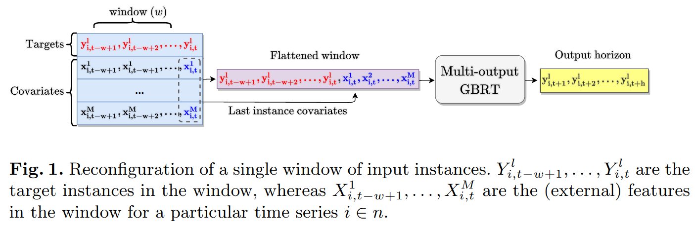

# Do We Really Need Deep Learning Models for Time Series Forecasting?

## 論文について (掲載ジャーナルなど)
- [Elsayed, S., Thyssens, D., Rashed, A., Jomaa, H. S., & Schmidt-Thieme, L. (2021). Do we really need deep  learning models for time series forecasting?. *arXiv preprint arXiv:2101.02118*.](https://arxiv.org/pdf/2101.02118.pdf)

## 概要
- 時系列予測タスクだとGradient Boosting Regression Tree（GBRT）= XGBoost のほうがDNNよりも高性能やで
    - GBRTモデルのいい使い方を提案したやで

## 問題設定と解決したこと
- 時系列予測は幅広い応用がある→良い時系列予測モデル欲しいなぁ

    - 例）電力消費量、交通量、大気の状態の予測

- 時系列予測モデルたち

    - 従来
        - ローリングアベレージ、ベクトル自己回帰、自己回帰統合移動平均に依存したモデル

    - 最近

        - DNN、行列分解モデル
            - ↑は従来の手法と比較して、過度に複雑化しがち

- DNNモデルって、扱いにくいし本当に精度向上してんのか？

    - 精度よくてもっと扱いやすい手法ないかなぁ
    - 本当に、進歩してるのか確認の意味も込めて評価するやで

    

- リサーチクエスチョン

    1.  時系列予測のためのウィンドウベース学習フレームワークの観点から、GBRTモデルの入出力構造を構成した時の効果はいかほどか
    2.  うまく構成したGBRTモデルの実力はSOTAのDNNモデルたちと比較していかほどか

- コントリビューション

    1.  GBRTへの入出力構造を工夫して時系列予測モデルを作成
        -   GBRTをウィンドウベースの回帰フレームワークに落とし込んだ
        -   モデルの入出力構造を特徴付けることで、つよつよ時系列予測モデルを構築
            -   コンテキスト情報の付与による恩恵を受けられるようにしたやで

    2.  ベースラインとの比較
        -   GBRTのウィンドウベースの入力設定が、ARIMAや素朴なGBRT実装など従来型の時系列予測モデルの精度を向上させることを実証的に証明
            -   時系列予測モデルにおける入力処理の重要性を強調するため

    3.  SOTAなDNNモデルと比較
        -   2種の時系列予測タスクにおける性能を調査
            -   単変量時系列予測タスク
            -   多変量時系列予測タスク

- 

## 何をどう使ったのか
- 論文図１より引用
    - 

- 時系列予測のGBRTによる素朴な実装では、GBRTモデルは柔軟性のを失う
    - 時系列の残りのテスト部分を予測するためにデータポイントの完全かつ連続したシーケンスとして、時系列の大部分に適合するように構成されるから

- GBRTへの入力をウィンドウベースに再構成し、複数の学習インスタンス（ウィンドウ）で学習することで、（成功した既存の）時系列予測モデルで使用される入力処理をシミュレートする
- 幅$w$のインスタンスの目標値$y_i$を連結し、入力ウィンドウ$w$の最後の時点$t$の共変量ベクトル$X^1_{i,t-w+1},\dots,X^M_{i,t}$を追加してベクトルを1次元化する（図1真ん中）
    - なんで最後の時点の共変量のみを追加するの？
        - 実験したらよかったから（後述）

- マルチアウトプットGBRTに入力して、入力した時系列の未来を予測する

- ロス関数：
    $$
    l(\hat y;Y):=\frac{1}{n}\sum^n_{i=1}\frac{1}{t^\prime}\sum^{t^\prime}_{j=1}(Y_{i,j}-\hat y_{\text{naive}}(X^1_{i,j},\dots, X^M_{i,j}))^2
    $$

    - ここで、
        - $X^1_{i,j},\dots,X^M_{i,j}$ は $j$ 時点の共変量、$M$ は共変量の次元、$i\in n$ は $n$ 個ある時系列のうち $i$ 番目のもの
        - $t^\prime$ は予測する未来の時系列の長さ
        - $Y_{i,j}$ は $j$ 時点のターゲット変数
        - $\hat y_{\text{naive}}(\cdots)$ は $X^1_{i,j},\dots,X^M_{i,j}$ をもちいて予測した値

## 主張の有効性の検証方法
- 実験デザイン
    - ベースラインの選定：下記観点から提案手法の比較対象となる論文を選択
        - トピック：時系列予測の分野に関する論文
        - データ構造：非同期時系列やグラフとして概念化されたデータなど特殊なデータ構造の論文は除外
        - 再現性：データやソースコードが一般に公開されているものに限定
        - 計算可能性：論文に記述された結果が再現可能で、合理的な時間で計算可能なもの

    - データセット：計11個
        - 単変量時系列予測タスク：7個
        - 多変量時系列予測タスク：4個

- 結果：
    - 提案手法が良さげ

## 批評
- [@JFPugetさんのツイート](https://twitter.com/JFPuget/status/1499739507905556484)
    - XGBoost better than deep learning for time series.  A paper confirming what ever Kaggler knows.
- [@tmaeharaさんのツイート](https://twitter.com/tmaehara/status/1499757003538894854)
    - NN が他モデルに負けてる話も，経験上，データ量を 100,000 倍にして 100,000 台のマシンで学習したら並ぶか逆転するので
- 共変量（Covariates）＝「解析するデータのうち、**連続量で表される変数**のこと」
- [Daniela-Shereen/GBRT-for-TSF](https://github.com/Daniela-Shereen/GBRT-for-TSF)
    - ハードコーディングすぎる…
    - 大丈夫か？？論文の結果信用できるかな…
    - ハイパラチューニングが謎

## 次に読むべき論文
- 
