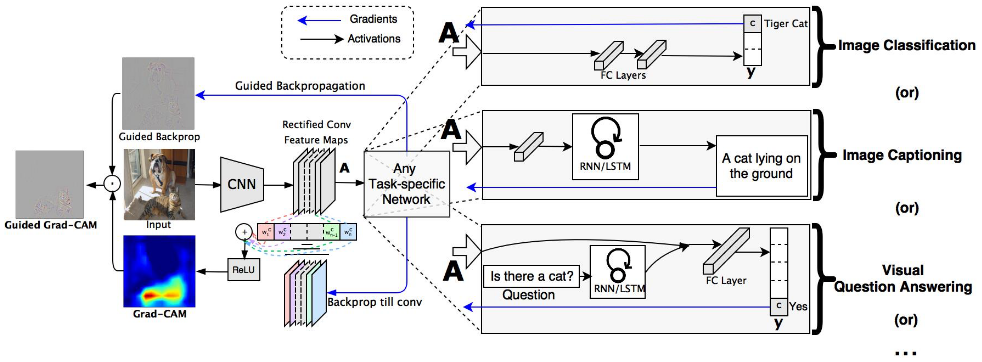
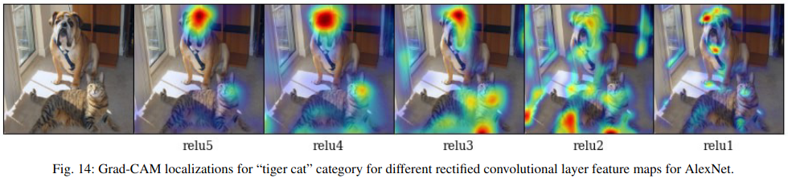

# Grad-CAM: Visual Explanations from Deep Networks via Gradient-based Localization

## 論文について (掲載ジャーナルなど)
- [Selvaraju, R. R., Cogswell, M., Das, A., Vedantam, R., Parikh, D., & Batra, D. (2017). Grad-cam: Visual explanations from deep networks via gradient-based localization. In Proceedings of the IEEE international conference on computer vision (pp. 618-626).](https://arxiv.org/pdf/1610.02391.pdf)

## 概要
- Gradient-weighted Class Activation Mapping (Grad-CAM)
- 予測値に対する勾配を重み付けすることで、重要なピクセルを可視化
  - CNNが見ている場所＝判断において重要な場所を可視化できる

- 論文では、既存の精細な可視化手法と組み合わせた Guided Grad-CAMも提案

## 問題設定と解決したこと
- CNNは個別に直感的な構成要素に分解することができないので、その予測を人間が解釈することは困難
  - CNNの予測の「視覚的説明」を生成したい
- 既存研究では、Fully-connected layers がないCNNの識別領域を特定する技術CAMが提案された
  - 本論文では、CAMを拡張して重要な領域を可視化する技術を提案
- 本論文のコントリビューション
  1. CNNベースのネットワークに対して、アーキテクチャの変更や再トレーニングを必要とせｔずに視覚的な説明を生成する手法Grad-CAMを提案
  2. 既存の高性能な分類モデル、キャプションモデル、VQAモデルにGrad-CAMを適用。画像分類では、一見不合理に見える予測に合理的な視覚的説明があることを示すことで、CNNのFailureに対する洞察を得ることができる
  3. データセットの偏りを明らかにすることにより、Grad-CAMの可視化がどのようにFailureの診断に役立つかについてPoCを示す
  4. 当時最先端のネットワークであるResNetsを画像分類とVQAに適用したGrad-CAMによる可視化
  5. Grad-CAMのニューロン重要度とニューロン名を用いてモデル決定のテキスト説明を得る
  6. ネットワークの予測に信頼がおけるのかどうか人間が判定する実験を実施

## 何をどう使ったのか
- Grad-CAMの概念図（論文図２より引用）
  - 
    - 大事なのは左半分
- Grad-CAMのアルゴリズム
  1. まずは、画像を普通に分類
  2. 分類結果（ソフトマックスの前）を使って誤差逆伝搬し、各畳込み層の勾配を計算
  3. 畳み込み層の勾配のGlobal Average Pooling (GAP)をとる
     - GAPは畳み込み層の勾配の平均値をとるだけ
     - GAPをとった値は、ターゲットクラスに対する特徴マップの重要度と考えることができる
  4. GAPを重みとした畳み込み層の重み付き和をとり、ReLUにかけて、元の画像サイズにリサイズ
     - ReLUをかけるのは、スコアに対する正の影響のみを取り出したいから
- Guided Grad-CAM
  - Grad-CAMはクラスを識別し、重要な（局所的な）画像領域を可視化することができるが、Guided Backpropagation のようにピクセル単位の重要領域を強調する能力に欠けている
  - Guided Backpropagationはピクセル単位で強調できるが、（その出力結果は画像全体にわたり）、クラス識別の根拠となった画像領域を示すのは不得意
  - Guided Backpropagationの結果とGrad-CAMによる可視化マップを要素ごとに乗算して両者のいいとこ取りをするのがGuided Grad-CAM

## 主張の有効性の検証方法
- 定量的な評価（別にSOTAっていうわけではない。つっこまれるからやってみました感）
  - Weakly-supervised Localization
    - ImageNet
  - Weakly-supervised Segmentation
    - PASCALVOC 2012
- ネットワークの予測に信頼がおけるのかどうか人間が判定する実験を実施
  - 機械学習（ニューラルネットワーク）に疎いユーザが「つよつよ」モデルと「よわよわ」モデルを識別するのに役立ったことがわかったやで
- VGG-16にかけたAdversarial noiseの影響
  - Adversarial noiseをかけた画像でも、Grad-CAMで犬の重要領域を可視化すると、ちゃんと犬のところに重要領域でたで、という報告
- **データセットのバイアスの特定**
  - 偏ったデータセットで訓練されたモデルは、実世界のシナリオに一般化しない可能性がある	
    - 性別、人種、年齢などのステレオタイプな見方をモデルが内蔵しちゃう
  - 医者と看護師の2値分類タスク
    - モデル：ImageNet pretrained VGG-16
    - Grad-CAMによる可視化により、看護師と医者を区別するために、顔や髪型を見ることを学習していることがわかった←性別のステレオタイプ
      - 女性医師を看護師と誤認識、男性看護師を医師と誤認識
      - 学習データでは、医師の画像の78%が男性、看護師の画像の93%は女性
- 異なる畳み込み層におけるGrad-CAMの可視化
  - 前段畳み込み層ほど重要領域の位置が悪くなることがわかる
  - 前段の層は局所的な特徴に注目し、後段の層は空間情報を保持したまま高度な意味情報をうまく捉えられている
  - 論文Fig 14から引用（Tiger catって書いてるけど犬の間違いでは？？ミスってませんか？）
    - 


## 批評
- ほんとに「説明」になってるんですかねぇ

  - 画像から人間が「解釈」しているんでは？

  - ここらへん人の認知みたいな話に入ってくるから難しいよな

    

- 参考記事

  - [【CNN+Grad-CAM】仕組みの解説と画像の予測根拠可視化](https://dajiro.com/entry/2020/06/26/234720)
    
    - これがわかりやすい
    
      

- 実装
  - [jacobgil/pytorch-grad-cam](https://github.com/jacobgil/pytorch-grad-cam)
    
    - ResNetやFaster R-CNNといったCNN系だけじゃなくViT, SwinTにも対応
    
      ```python
      from pytorch_grad_cam import GradCAM, ScoreCAM, GradCAMPlusPlus, AblationCAM, XGradCAM, EigenCAM, FullGrad
      from pytorch_grad_cam.utils.model_targets import ClassifierOutputTarget
      from pytorch_grad_cam.utils.image import show_cam_on_image
      from torchvision.models import resnet50
      
      model = resnet50(pretrained=True)
      target_layers = [model.layer4[-1]] # ←モデルによって変わるよ！
      input_tensor = # Create an input tensor image for your model..
      # Note: input_tensor can be a batch tensor with several images!
      
      # Construct the CAM object once, and then re-use it on many images:
      cam = GradCAM(model=model, target_layers=target_layers, use_cuda=args.use_cuda)
      
      # You can also use it within a with statement, to make sure it is freed,
      # In case you need to re-create it inside an outer loop:
      # with GradCAM(model=model, target_layers=target_layers, use_cuda=args.use_cuda) as cam:
      #   ...
      
      # We have to specify the target we want to generate
      # the Class Activation Maps for.
      # If targets is None, the highest scoring category
      # will be used for every image in the batch.
      # Here we use ClassifierOutputTarget, but you can define your own custom targets
      # That are, for example, combinations of categories, or specific outputs in a non standard model.
      targets = [e.g ClassifierOutputTarget(281)]
      
      # You can also pass aug_smooth=True and eigen_smooth=True, to apply smoothing.
      grayscale_cam = cam(input_tensor=input_tensor, target_category=target_category)
      
      # In this example grayscale_cam has only one image in the batch:
      grayscale_cam = grayscale_cam[0, :]
      visualization = show_cam_on_image(rgb_img, grayscale_cam, use_rgb=True)
      ```
      
      
      
      

## 次に読むべき論文
- [Grad-CAM++](https://arxiv.org/pdf/1710.11063.pdf)
