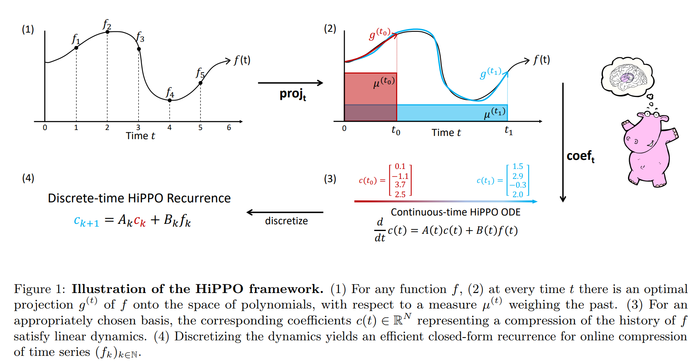
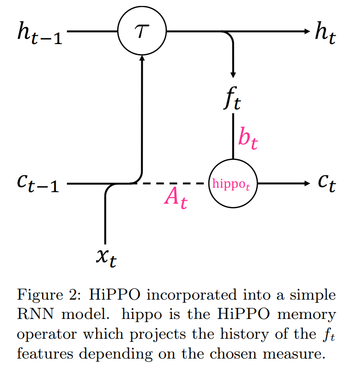

# HiPPO: Recurrent Memory with Optimal Polynomial Projections

## 論文について (掲載ジャーナルなど)
- [Gu, Albert, et al. "Hippo: Recurrent memory with optimal polynomial projections." Advances in Neural Information Processing Systems 33 (2020): 1474-1487.](https://proceedings.neurips.cc/paper/2020/file/102f0bb6efb3a6128a3c750dd16729be-Paper.pdf)

## 概要
- 逐次的に入ってくる時系列データから学習することを考える
    - 中心的な課題は、「多くのデータが処理されるにつれて、どんどん増えてくる履歴を段階的に表現していくこと」である

- 本論文では、多項式関数の基底へ射影することにより、連続信号や離散時系列を**オンライン**で圧縮する一般的なフレームワーク（HiPPO)を提案
    - 過去の各時刻ステップの重要度を指定する尺度が与えられると、HiPPOは自然なオンライン関数近似問題に対する最適解を生成する

- 提案する新しい記憶更新機構（HiPPO-Legs）は以下の理論的な利点がある
    - 時間スケールに対するロバスト性
        - DNNやLSTMは同じ時間スケールのデータでないと精度がでないが、HiPPOは異なる時間スケールのデータでも性能が落ちない

    - 高速な記憶の更新
    - 有界なGradients

## 問題設定と解決したこと
- 逐次的に入ってくるデータのモデリングと学習は、以下のタスクの基礎となり、基本的な問題
    - 言語モデリング、音声認識、映像処理、強化学習

- 長期的かつ複雑な時間依存性をモデル化する上で、「記憶＝以前の時間ステップからの情報を保存し、取り込むこと」が重要
    - より多くのデータが逐次的に入ってきたときを考えると、記憶はオンラインで更新される必要がある
    - 限られたストレージを用いて、蓄積されるhistory全体の表現を学習しなければならない

- 上記の問題に対する既存の手法として、RNNがあげられる
    - どんな方法？
        - 多くの情報を取り込みながら時間と共に変化していく状態をモデル化するアプローチ

    - RNNの課題は？
        - メモリバク食い
        - gradientsの消失

    - RNNの課題を克服するヒューリスティックな方法として、以下が挙げられている
        - LSTM、GRU、フーリエ再帰ユニット、ルジャンドルメモリユニット（LMU）

    - それでもまだ残る課題
        - gradients の消失
            - 数万ステップもあるような、とても長いデータだと記憶が保持できない
        - シーケンス長や時間スケールに対する事前に仮定を置いている
            - シーケンス長、時間スケールが異なるデータには適用できない
        - 「長期依存性をどの程度うまくとらえることができるか」についての理論的保証が無い

- 本論文で解決したこと
    1.  記憶に扱う方法の理論的な定式化
        -   既存手法の統一的な見解を示した

    2.  時間スケールへの事前の仮定なく、任意のシーケンス長のデータを扱うことができる手法の提案
    3.  記憶を扱うことに対する厳密な理論的証明

## 何をどう使ったのか
- 提案手法 **HiPPO** (high-order polynomial projection operators) 
    - 任意の関数を与えられた尺度に関して直交多項式空間に射影する演算子
        - 尺度：過去における各時刻のデータの重要度
- 入力関数$f(t) : \mathbb{R}_+ \rightarrow \mathbb{R}$が与えられたとき、逐次的に入ってくる入力を理解し、将来の予測を行うために、時刻$t\ge 0$ ごとに累積history $f_{\le t}:= f(x)|_{x\le t}$ を操作することが必要
    -   関数空間は非常に大きいので、historyを完全に記憶することができない→圧縮する
    -   historyを有界次元の部分空間に射影する
    -   しかも、圧縮したhistory の表現をオンラインで更新していく
- HiPPOの数学面の構成要素
    1.  測度に関する関数近似
        -   近似の質を評価するために、関数空間における距離を定義する必要がある
        -   $[0,\infty)$上の確率測度を指定することで、（関数と関数の内積を定義し、）2乗可積分関数の空間＝ヒルベルト空間を用意する
            -   内積から誘導されるノルムも自然に定まる

    2.  多項式基底展開
        -   関数空間の任意の$N$次元部分空間$\mathcal{G}$は、近似のための適切な候補
        -   パラメータ$N$は近似の次数＝圧縮の大きさに相当し、投影されたhistoryは$\mathcal{G}$の任意の基底における展開の$N$個の係数で表すことができる
        -   本論文では、$\mathcal{G}$が$N$未満の次数の多項式の集合であるように、自然基底として多項式を用いる

    3.  オンライン近似
        -   時間$t$ごとに$f_{\le t}$を近似することに関心があるので、測度も時間によって変化させる
            -   すべての$t$について、$\mu^{(t)}$を$(-\infty,t]$上の測度とする
                -   なんで$(-\infty, t]$？→$f_{\le t}$は時間$t$までしか定義されないので

        -   $\|f_{\le t}-g^{(t)} \|_{L_2 (\mu^{(t)})}$を最小化する$g^{(t)}\in\mathcal{G}$を求める
            -   直感的な解釈
                -   測度$\mu$が入力されるデータのそれぞれの部分の重要度をコントロール
                -   基底は許容される近似を定義する

        -   解きたい課題としては、
            -   $\mu^{(t)}$が与えられたときにいかにして閉じられた形で、（与えられた関数と近似する関数の距離を最小化する）最適化問題をとくか
            -   $t\rightarrow \infty$のときに、基底の係数をオンラインで維持するか

### HiPPOの定式化

-   **[定義 1]**
    -   時間 $t$ に伴って変化する $(-\infty, t]$ 上の測度族を $\mu^{(t)}$ 、多項式関数の$N$次元部分空間を $\mathcal{G}$ 、連続関数  $f:\mathbb{R}_{\ge0}\rightarrow \mathbb{R}$ とする。このとき、*HiPPO* は時間$t$ごとに射影演算子 $\text{proj}_t$ と係数抽出演算子 $\text{coef}_t$ を定義し、それらは以下の性質を持つ。
        1.   $\text{proj}_t$ は、関数 $f$ を時間 $t$ までに制限した関数 $f_{\le t}:=f(x)|_{x\le t}$ をとり、$f_{\le t}$ を近似誤差 $\| f_{\le t} - g^{(t)} \|_{L_2 (\mu^{(t)})}$ が最小になる多項式 $g^{(t)}\in \mathcal{G}$ に写像する。
        2.   $\text{coef}_t: \mathcal{G}\rightarrow \mathbb{R}^N$ は、多項式関数 $g^{(t)}$ を測度 $\mu^{(t)}$ に関して定義される直交多項式の基底の 係数 $c(t)\in \mathbb{R}^N$ に写像する。
    -   演算子の合成 $\text{coef}\circ \text{proj}$ を*hippo*とよび、この演算子は 関数 $f: \mathbb{R}_{\ge0}\rightarrow \mathbb{R}$ を最適な射影係数 $c:\mathbb{R}_{\ge0}\rightarrow \mathbb{R}^N$ に写像する。すなわち、$(\text{hippo}(f))(t)=\text{coef}_t(\text{proj}_t (f))$ である。
-   
    -   各時間 $t$ について最適射影 $\text{proj}_t(f)$ は内積によってよく定義されるが、素朴に計算するのは困難
    -   係数関数 $c(t)=\text{coef}_t(\text{proj}_t(f))$ は、ある$A(t)\in \mathbb{R}^{N\times N}$と$B(t)\in \mathbb{R}^{N\times 1}$に対して $\frac{d}{dt}c(t)=A(t)c(t)+B(t)f(t)$ を満たすODE（常微分方程式）形式であることを付録Dに記載している。
    -   このODEを解く（離散的な漸化式を解く）ことにより、$c(t)$ をオンラインで簡単に求めることができる
        -   逆順に考えるとなんで時間に伴って変化する測度と多項式近似を使ってるのかわかりよい
            -   時間に伴って変化する測度は近似の品質を操作したいから、直近の過去を重要視したいという要望に答えるため
            -   測度に関する内積を定義→ヒルベルト空間を考えるのは線型結合の係数の導出が簡単だから
            -   **(4)の漸化式の形にしたいから、多項式関数を使った近似を選択している**
                -   付録C.3の式(20)を見るとわかりやすい。
                -   （$n$次の多項式）×（重み関数=時間と共に変化する測度）の形の積分の微分
                    →$n-1$ 次の多項式 + $N-1$次の多項式の形になる
                    →漸化式の形になる
                    -   [注意]まだふわっとした理解になってるぞ！
    -   HiPPO 演算子は離散化すると実数列を受け取り、$N$次元ベクトルを返す

### 時間発展する測度と（それと対応する）HiPPO ODEsの例

-   様々な測度の例

    -   *The translated Legendre (LegT) measures*

        -   $[t-\theta, t]$ に一様な重みを割り当てる測度
            -   $\theta$ はスライディングウィンドウの長さ（要約される history の長さ）を表すハイパーパラメータ
            -   ※なんで*translated*なのか？
                -   ルジャンドル多項式は$[-1,1]$の範囲で定義される関数。これを$[t-\theta,t]$の範囲に変換しているということ
        -   $$
            \text{LegT}: \mu^{(t)}=\frac{1}{\theta}\mathbb{1}_{[t-\theta, t]}(x)
            $$

            

    -   *The translated Laguerre (LagT) measures*

        -   $(-\infty, t]$に指数関数的に減衰する重みを割り当てる測度

            -   最近の history を重視する

        -   $$
            \text{LagT}: \mu^{(t)}
            &=& e^{-(t-x)}\mathbb{1}_{(-\infty, t]}(x) \\
            &=& \begin{cases}
            e^{x-t}& \text{if}\quad x\leq t \\
            0& \text{if}\quad x>t
            \end{cases}
            $$

-   **[定理 1]**

    -   LegTとLagTについて、定義1をみたす HiPPO 演算子は、$\frac{d}{dt}c(t)=-Ac(t)+B(t)$ where $A \in \mathbb{R}^{N\times N}, B\in\mathbb{R}^{N\times 1}$ の形の線形時不変 (linear time-invariant : LTI)常微分方程式 (ODEs) で与えられる。

$$
\text{LegT}:&\\
A_{nk} &= \frac{1}{\theta} \begin{cases}
(-1)^{n-k}(2n+1) & \text{if}\quad n\geq k \\
2n+1 & \text{if}\quad n\leq k
\end{cases}\ , \quad
B_n = \frac{1}{\theta}(2n+1)(-1)^n
$$

$$
\text{LagT:} & \\
A_{nk} &= \begin{cases}
1 & \text{if}\quad n\geq k \\
0 & \text{if}\quad n\leq k
\end{cases}\ , \quad
B_n = 1
$$

### HiPPO recurrences: from Continuous to Discrete Time with ODE Discretization

-   連続の場合: HiPPO 投影演算子は
    1.  入力関数 $f(t)$ を受け取り、
    2.  出力関数 $c(t)$ を生成する
-   離散の場合：HiPPO 投影演算子は
    1.  入力関数 $(f_k)_{k\in\mathbb{N}}$ を受け取り、
    2.  あるステップサイズ $\Delta t$ に対して、$f(k \cdot \Delta t) = f_k$ となる関数 $f(t)$ を暗黙的に定義し、
    3.  ODE ダイナミクスによって関数 $c(t)$ を生成し、
    4.  出力列 $c_k:=c(k\cdot \Delta t)$ まで離散的に戻される

-   ODE $\frac{d}{dt} c(t)=u(t, c(t),f(t))$ を離散化する基本的な方法は、

    -   ステップサイズ $\Delta t$ を選び、

        -   ※一般に、このプロセスは離散化ステップサイズ $\Delta t$ に敏感

    -   離散更新 $c(t+\Delta t)=c(t)+\Delta t\cdot u(t,c(t),f(t))$ を実行する

        -   これはオイラー法として知られているもの、説明のためだけの記述

        -   実装上では、数値的に安定なバイリニア法とZOH法を使用。付録B.3を参照

            -   [意見]改善できるポイントかも!?

### HiPPO-LegS: Scaled Measures for Timescale Robustness

-   オンライン関数近似と”記憶”の関係を明らかにすることで、測度を適切に選択するだけで、より良い理論的特性をもつ記憶機構を作り出すことができる

-   信号処理ではスライディングウィンドウが一般的だが、記憶のより直感的なアプローチは、**忘却をさけるためにウィンドウを時間と共にスケールさせるべき**

-   新しい測度 **scaled Legendre measure (LegS)** を提案する。

    -   LegS はすべてのhistoryに一様な重みを与える。すなわち、 $[0,t]:\mu^{(t)}=\frac{1}{t}\mathbb{1}_{[0,t]}$  。

-   LegS をHiPPOフレームワークに組み込む

    -   **[定理 2]**：**HiPPO-LegS** のダイナミクスは以下となる。

        -   連続時間ダイナミクス

        $$
        \frac{d}{dt}c(t)=-\frac{1}{t}Ac(t)+\frac{1}{t}Bf(t)
        $$

        -   離散時間ダイナミクス

        $$
        c_{k+1}=\left( 1- \frac{A}{k} \right)c_k+\frac{1}{k}Bf_k \label{d-hippo-s}
        $$

        -   ここで、

        $$
        A_{nk} = \begin{cases}
        (2n+1)^{\frac{1}{2}}(2k+1)^{\frac{1}{2}} &\text{if}& n>k \\
        n+1 &\text{if}& n=k \\
        0 &\text{if}& n<k
        \end{cases}\ , \qquad B_n = (2n+1)^{\frac{1}{2}}
        $$

-   HiPPO-LegS の理論的特性として以下があげられる。（付録E参照）

    1.  入力の時間スケールに対して不変である
        -   **[命題 3]** 時間スケールへのロバスト性
            -   任意のスカラー $\alpha >0$ について、もし $h(t)=f(\alpha t)$ であれば、$\text{hippo}(h)(t)=\text{hippo}(f)(\alpha t)$ である。
            -   すなわち、$\gamma:t \mapsto \alpha t$ を任意の拡張関数とすると、$\text{hippo}(f\circ\gamma)=\text{hippo}(f)\circ\gamma$ である。
    2.  計算が早い
        -   LegS は $(\ref{d-hippo-s})$ の固定行列 $A$ に特殊な構造を持ち、計算を高速化できるアルゴリズムがある
            -   [A two-pronged progress in structured dense matrix vector multiplication](https://arxiv.org/abs/1611.01569)
                -   これも Albert Gu さんが著者に入ってんな…つよすぎ
        -   **[命題 4]** 計算効率性
            -   一般化バイリニア変換による離散化では、HiPPO-LegS の漸化式 $(\ref{d-hippo-s})$ の各ステップを $O(N)$ で計算できる
    3.  勾配と近似誤差が有界である
        -   バックプロパゲーションに基づく学習では、勾配の大きさが時間に対して指数関数的に減少するため、勾配消失の問題がおきる。
        -   LegSはコクのためにデザインされているため、勾配消失の問題を回避することができる
        -   **[命題 4]** 勾配フロー
            -   任意の時間 $t_0<t_1$ について、時刻 $t_0$ の入力に対する時刻 $t_1$ の出力のHiPPO-LegS 演算子の勾配ノルムは $\left\| \frac{\partial c(t_1)}{\partial f(t_0)} \right\|=\Theta \left(\frac{1}{t_1} \right)$ である。
        -   **[命題 5]** 近似誤差境界
            -   $f:\mathbb{R}_+ \rightarrow \mathbb{R}$ を微分可能な関数とし、$g^{(t)}=\text{proj}_t(f)$ を時間 $t$ における最大多項式次数 $N-1$ のHiPPO-LegSによる射影とする。
            -   $f$ が $L$-Lipschitz であれば、$f_{\le} -g^{(t)} =O(\frac{tL}{\sqrt{N}})$ となり、$f$ が次数 $k$ の有界微分を持つ場合は、 $\| f_{\le t} - g^{(t)} \| = O(t^k N^{-k+\frac{1}{2}})$ となる。
                -   [意見]
                    -   単語も概念がわかんねー。勉強が足りない。

## 主張の有効性の検証方法

- HiPPO ダイナミクスは、様々なモデルに容易に組み込むことができる単純な漸化式である。
- HiPPO-LegS を単純なRNNに組み込んだ場合、既存のアーキテクチャよりも以下の3つの点で改善されたアーキテクチャになる
    1.  長期時間依存性が要求されるタスクにおいて、既存の手法よりも高精度
    2.  時間スケールの変化に対してロバスト
    3.  数百万回の時間ステップにわたって高速かつ正確なオンライン関数再構成が可能

- HiPPOをRNNモデルに組み込んだ模式図
    - 
- 検証に用いたデータセット
    1.  精度
        - パーミュートされたMNISTタスク

            - 固定された順序でピクセルごとにモデルへ入力を与えるタスク
            - モデルは分類ラベルを出力する前に、画像全体を非局所的な構造で順次処理しなければならず、長期的な依存関係を学習する必要がある
            - 結果：HiPPO-LegSは全てのモデルのなかでSoTA（表1参照）
                - LegTは適したウィンドウサイズを指定できれば、良好な性能だが、ウィンドウサイズが最適値からブレたら大幅な性能低下
                - LagTも適した $\Delta t$を指定できれば、良好な性能

        - Copying task

            - 記憶力を直接的に測るタスク

                - モデルが最初に見たトークンのシーケンスを再現するタスク
                    - 入力は$L+20$桁の数字列。最初の10個のトークン $(a_0,a_1,\dots,a_9)$ は$\{1,\dots,8\}$の中からランダムに選ばれ、中間の $N$ 個のトークンは0に、最後の10個のトークンは9に設定される。
                    - 最後の10個の時間ステップで、キュートークン9が提示されるたびに、$(a_0,\dots,a_9)$ を順番に出力し、正解率が測られる。

            - 結果：HiPPO-LegS は学習可能
                - 適切にウィンドウサイズを設定したLegTも学習可能
                - 他モデルは（勾配消失問題により）壊滅的で学習すらままならない

    2.  時間スケールの変化に対するロバスト性
        -   Character Trajectories
            -   一人のユーザーから固定サンプリングレートで収集したペンストローク測定値から文字を分類するタスク
                -   手書きが早い人/遅い人で、データポイント間のスケールがバラバラになる
                -   手書きの早い/遅いをエミュレートするために、時系列データ生成プロセスを2種類検討
                    1.  固定レートで基本シーケンスをサンプリングする設定において、テストデータのサンプリングレートを変更
                        -   シーケンスは可変長なので、モデルはデータのサンプリングレートを検出できない

                    2.  タイムスタンプを不規則にしてサンプリング。テストのタイムスタンプをスケーリング

        -   結果：HiPPO-LegS は90%を超える精度を達成（表2参照）
            -   HiPPO-LegSは、基礎となるデータを連続関数をとしてモデル化し、離散化を通してのみ離散入力を扱うので、タイムスケールの変化に対してロバスト
            -   他のモデルは壊滅的

    3.  高速かつ正確なオンライン関数再構成
        -   ロングレンジ関数近似タスク
            -   長さ106の連続時間帯域制限白色雑音過程（つまり、ランダムな時系列データってこと）からランダムなサンプルを選択し、メモリを256ユニット以下に維持したまま、入力を再構成するタスク
                -   メジャーなタスクというわけではなく、HiPPO-LegSの能力を確かめるために作ったタスクやろな
        -   結果：HiPPO-LegSは、高速に非常に長いシーケンスに対しても関数近似可能
            -   HiPPO-LegS は、シングルCPUを用いて、470,000 step/sec で処理可能
                -   LMU、LSTMの10倍のスピードで処理可能
    4.  追加の実験
        -   一般的な配列予測タスクにおいても、HiPPO-LegSが良好に動作することを確認
        -   IMDB映画レビューデータセットのセンチメント分類タスク
            -   映画レビューの文章から、レビュアーの感情がポジティブかネガティブかに分類するタスク

        -   マッキースピングラス予測
            -   カオス力学系のモデル化能力をテストするタスク

## 批評
- 俺に数学面での知識がなさすぎる
    - 力学系
        - 常微分方程式

    - ルジャンドル多項式・ラゲール多項式の周辺

- [TODO]
    -   ルジャンドル多項式の性質についてまとめる
    -   P.27 D.1 Coefficient Dynamics の数式を追う
        -   HiPPO/S4解説の32~41ページも参考になるやで

## 次に読むべき論文
- S4
