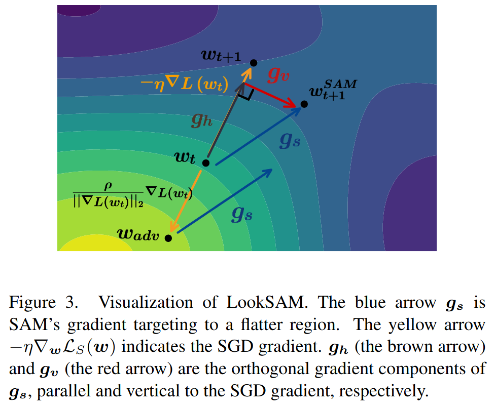

# Towards Efficient and Scalable Sharpness-Aware Minimization

## 論文について (掲載ジャーナルなど)
- [Liu, Yong, et al. "Towards efficient and scalable sharpness-aware minimization." *arXiv preprint arXiv:2203.02714* (2022).](https://arxiv.org/pdf/2203.02714.pdf)

## 概要
- 損失関数の形状と汎化を結びつけるSAMがVision Transformersなどの大規模モデルの学習において大幅な性能向上を実証している
- SAMの課題として、SAMの更新則が各ステップで2回の逐次勾配計算を必要とし、計算オーバーヘッドが2倍になることである
- 本論文では、SAMの学習コストを大幅に削減する新規アルゴリズムLookSAMを提案する
    - LookSAMは、inner gradient の上昇のみを周期的に計算する機構

## 問題設定と解決したこと
- 

## 何をどう使ったのか
- 

## 主張の有効性の検証方法
- 

## 批評
- 

## 次に読むべき論文
- 

