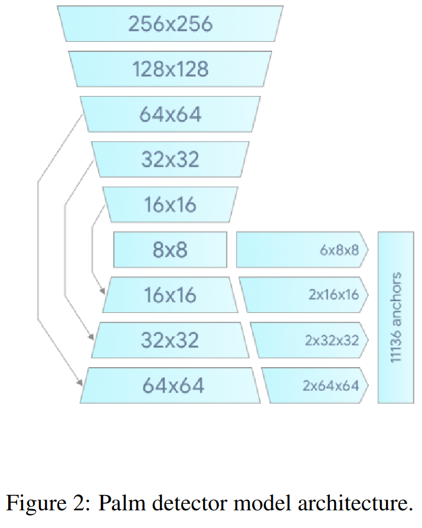
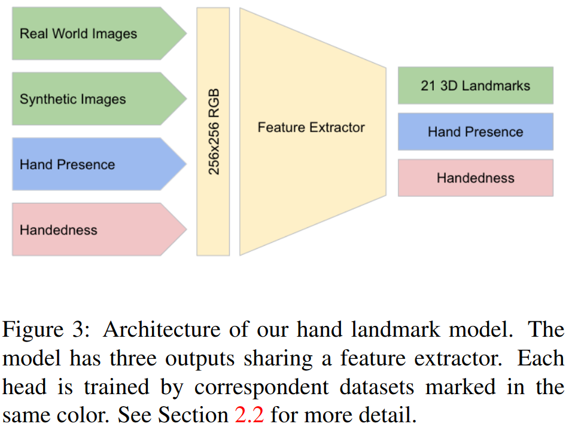

# MediaPipe Hands: On-device Real-time Hand Tracking

## 論文について (掲載ジャーナルなど)
- [Zhang, F., Bazarevsky, V., Vakunov,  A., Tkachenka, A., Sung, G., Chang, C. L., & Grundmann, M. (2020).  Mediapipe hands: On-device real-time hand tracking. *arXiv preprint arXiv:2006.10214*.](https://arxiv.org/pdf/2006.10214.pdf)

## 概要
- RGB画像から人間の手の骨格を予測する*リアルタイム・オンデバイス・ハンドトラッキング・ソリューション*を提案
- クロスプラットフォームなMLソリューション構築のためのフレームワークであるMediaPipeを用いて実装

## 問題設定と解決したこと
- ハンドトラッキングは、AR/VRにおいて自然なインタラクションやコミュニケーションを実現するための重要なトピック
- ビジョンベースのハンドポーズ推定は長年研究されてきた
    - 既存研究：
        - 深度センサを用いた方法
            - 問題点：特殊なハードウェアを用意しなければならない

        - 大きい深層学習モデルを用いた方法
            - 問題点：汎用的なモバイルデバイスでリアルタイムに実行できないため、強力な計算能力のあるプラットフォームでしか動かない

- 本論文では、上記の問題点を解決する手法を提案する
    - 汎用的なデバイス（RGBカメラ with モバイル機器＝スマホ）でリアルタイム動作するソリューション

## 何をどう使ったのか
- ハンドトラッキングのパイプラインは2つのモデルで構成
    1.  手のひら検出器：画像から手のひらを検出
    2.  手のランドマークモデル：手のひら検出器により切り出された手のバウンディングボックスから手のランドマークを検出（ランドマークの位置と奥行きまで推定）

- なんで2段階で構成？
    - 正確に切り取られた手のひら画像からランドマークをとることで、回転・移動・スケールなどデータ補強の必要性を大幅に減らし、ネットワークの能力のほとんどをランドマークの推定精度に充てることができる
    - リアルタイムトラッキングをする際には、前のフレームのランドマーク予測から現在のフレームの手のバウンディングボックスを導出することで、全てのフレームに検出器を適用することを回避できる
        - つまり、1段階目の処理をスキップできる

    - 視覚的特徴から「手」を検出するのは困難
        - 「顔」は目や口の周りなどコントラストが高いパターンがあるので比較的楽
        - 手はのっぺりしてることが多いのでむずい

    - →「指が連なっている手」を検出するよりも先に「手のひら」や「拳」のような見つけやすいものから検出しよう
        - 手のひら、拳は正方形のバウンディングボックスのみでモデル化でき、アスペクト比を無視できるため検出が容易

- 手のひら検出器
    - エンコーダー・デコーダー型のモデルを使用
        - エンコーダー・デコーダー型にすることで、手が大きく写っている場合にも小さく写っている場合にも対応できるらしい（FPNのような構造）
        - ロス関数はFocal Loss
        - 

-   Hand Landmark Model
    - 手のひら検出器で抽出した手の領域から下記を推定するHand LandMark Modelを開発
        1.  x, y座標＋（手首点からの）相対深度からなる21個のランドマーク
        2.  入力画像中に手が存在する確率を示す手のフラグ
        3.  左手から右手かの2値分類
    - 上記3つを推定する際に使用する特徴抽出器はひとつだけ
        - 
        - <u>2の手の存在確率が閾値より低い場合、手のひら検出からやりなおし</u>
        - GPUがないモバイルデバイス上のCPU推論する場合にもデスクトップ上でも推論する場合にも対応するため、軽いモデルと重いモデルの2つのバージョンを設計
-   データセットとアノテーション
    -   3つのデータセットを作成
        1.  In-the-wild データセット	
            -   地理的な多様性、様々な証明条件、手の外観などバラエティに富んだ6k枚の画像
            -   マイナスポイント：手の複雑な動きが含まれていないこと
        2.  自社で収集したジェスチャーデータセット
            -   ハンドジェスチャーを様々な角度から撮影した10k枚の画像
            -   マイナスポイント：30人のみから収集され、背景のバリエーションが限られていること
                -   <u>ロバスト性を向上させるために、上のIn-the-wildデータセットとジェスチャーデータセットで補完しあうことが重要</u>
        3.  合成データセット
            -   奥行き（相対深度）のデータを追加するために、高品質な合成ハンドモデルをレンダリング
            -   手のポーズを変えていくビデオシーケンスを作成し、100k枚の画像をサンプリング
            -   マイナスポイント：（論文中に記載がないけど）用意にリッチな計算機が必要とか
    -   手のひら検出器では、In-the-wildデータセットのみ使用
        -   手の位置特定するだけだから簡単。外見のバリエーションがたくさんあるデータセットを使用
    -   Hand Landmark Modelでは全てのデータセットを使用
        -   ランドマーク
            -   実世界の画像には21個のランドマークを付与して学習
            -   合成画像データセットでは、グランドトゥルースの3次元関節を使って学習
        -   手の存在確率
            -   正例：アノテーションされた手の領域、負例：手領域以外の領域をサンプリングして学習

## 主張の有効性の検証方法
- 実世界データセットと合成データのみのデータセットと2つを組み合わせたデータセットでランドマークモデルの精度を比較
    - 組み合わせたデータセットでMSE13.4%になって最も高精度

- 軽いモデルと重いモデルの精度と処理時間を計測
    - トレードオフあり
    - モデルを重いものにすると、精度微増・処理時間大幅に増大

## 批評
- 計算量減らすための工夫がたくさん…
    - 実装大変やろうに…さすがGoogle
    - 敗北感を感じますね

- きちんとソリューションから逆算してモデルの入出力作ってる。かしこい
    - Hand Landmark Modelの出力をトリガーに手のひら検出やり直すところとか
    - 勉強になるなぁ…

## 次に読むべき論文
- MediaPipe
    - [Camillo Lugaresi, Jiuqiang Tang, Hadon Nash, Chris McClanahan, Esha Uboweja, Michael Hays, Fan Zhang, ChuoLing Chang, Ming Guang Yong, Juhyun Lee, Wan-Teh Chang, Wei Hua, Manfred Georg, and Matthias Grundmann. Mediapipe: A framework for building perception pipelines. volume abs/1906.08172, 2019.]((https://arxiv.org/pdf/1906.08172.pdf))
- FPN
    - [sung-Yi Lin, Piotr Doll ́ar, Ross B. Girshick, Kaiming He, Bharath Hariharan, and Serge J. Belongie. Feature pyramid networks for object detection. CoRR, abs/1612.03144, 2016.](https://arxiv.org/pdf/1612.03144.pdf)
