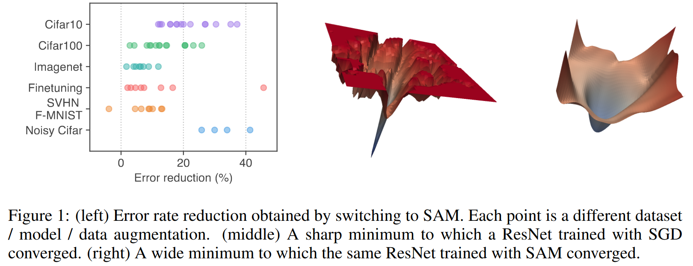
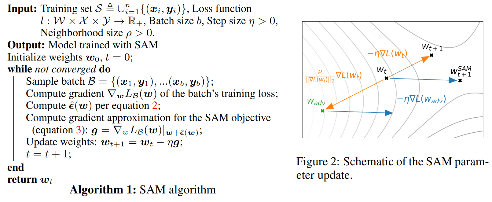

# Sharpness-Aware Minimization for Efficiently Improving Generalization

## 論文について (掲載ジャーナルなど)
- [Foret, P., Kleiner, A., Mobahi, H.,  & Neyshabur, B. (2020). Sharpness-aware minimization for efficiently improving generalization. *arXiv preprint arXiv:2010.01412*.](https://arxiv.org/pdf/2010.01412.pdf)

## 概要
- 大規模なモデルでは、学習損失の値によってモデルの汎化能力がほとんど保障されないという問題が存在
- 本論文では、損失関数の値とシャープネスを同時に最小化する最適化アルゴリズム **Sharpness-Aware Minimization (SAM)** を提案
    - 実装：[google-research/sam](https://github.com/google-research/sam)

- 様々なベンチマークで実験した結果、SAMを用いることによりモデルの汎化能力が改善されることを実証

## 問題設定と解決したこと
- DNNは、様々なタスクで既存の機械学習手法よりも高いパフォーマンスを達成しているが、成功の大部分は過剰なパラメータに依存している
- 過剰なパラメータ数は、学習データを容易に記憶することができ、簡単にオーバーフィットする問題も起こす
- 損失関数を学習データの集合上で単に最小化するだけでは、満足な汎化を達成することができない
- 損失関数の形状（ランドスケープ）は、
    - 一般的に複雑かつ非凸
    - ローカルおよびグローバルミニマムが多数存在
    - 異なるグローバルミニマムは異なる汎化能力を持つモデルをもたらす

- 本論文では、損失関数のランドスケープの幾何学と汎化能力の関連を直接利用した新しい最適化アルゴリズムSAMを提案する
    1.  損失関数の値とシャープネスを同時に最小化することにより、モデルの汎化能力を向上させることができる
    2.  広く研究されているコンピュータビジョンの課題およびモデルにおいて、モデルの汎化能力が向上することを確認
    3.  ラベルノイズに対して、頑健なモデルができることも確認
    4.  損失関数のシャープネスに対する新しい概念m-shapnessを考察することによって、損失関数のシャープネスと汎化能力の関係を詳しく考察

- 論文図1より引用
    - （左）SAMに切り替えることでエラーレートの減少幅。（右）SGDとSAMを用いた場合の損失関数の形状の比較
    - 

- 

## 何をどう使ったのか
- アルゴリズム概要
    1.  現地点の勾配を計算
    2.  坂を登り、登った先の勾配を計算
    3.  現地点から、「登った先の勾配」の方向に移動
- 論文図2より引用
    -   

## 主張の有効性の検証方法
- 

## 批評
- 

## 次に読むべき論文
- 

