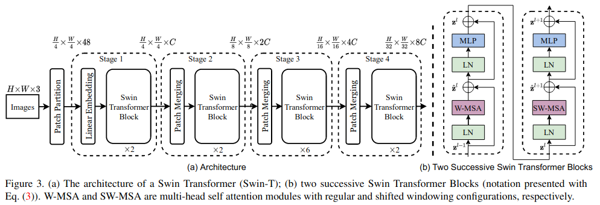
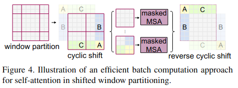

# Swin Transformer: Hierarchical Vision Transformer using Shifted Windows
- [Liu, Z., Lin, Y., Cao, Y., Hu, H., Wei, Y., Zhang, Z., ... & Guo, B. (2021). Swin transformer: Hierarchical vision transformer using shifted windows. arXiv preprint arXiv:2103.14030.](https://arxiv.org/abs/2103.14030)

## 概要
- Swin Transformer を提案
- Shifted windows で計算される階層的な特徴マップを構築する Transformer により上記問題を解決して SOTA をだしたよ

## 問題設定と解決したこと
- Language 領域で高い性能を上げているTransformerを Vision 領域に持ってきたよ
- Language 領域と Vision 領域で主に2つの違いがある
  1. スケール
     - テキスト中の単語トークンと違って、画像中の（検出対象の）物体のスケールが大きく変化すること
     - Vision 領域では多様な解像度や物体スケールに対応しないといけない
     - *物体検出タスクで問題になる*
  2. 画像中のピクセルの解像度が高い
     - テキスト中の単語と比較して、画像中のピクセルの解像度がはるかに高い
     - Transformer の計算量は入力の2乗オーダーになるため計算量がパないことになる
     - *領域分割タスクで問題になる*
- これらを工夫をいれることで解決したよ

## 何をどう使ったのか
- Swin Transformerに導入された工夫
  - Patch Merging
    - データの縦横サイズを小さくする
  - Shifted windows
    - 画像中の局所領域内の Attention を計算

- アーキテクチャ概要
  1. 入力されたRGB画像を非重複パッチに分割する
     - 論文の実装では、$4\times4$ パッチに分割（各パッチの特徴は$4\times4\times3=48$）
     - 各パッチは、 Transformer の「トークン」として扱われる
  2. 各パッチの特徴を処理する（Stage 1）
     - 任意の次元$C$に射影する線形埋め込み層を適用
     - Swin Transformer Block （自己アテンションの計算を修正した変換器ブロック）を適用
       - トークン数($\frac{H}{4}\times\frac{W}{4}$)を維持
  3. 階層的な表現を生成するため、ネットワークが深くなるにつれ Patch Merging 層によって隣接するパッチ群の特徴を連結。トークン数を減らして処理する（Stage 2）
     - トークン数は$2\times2=4$の倍数に減少し、出力次元は$2C$に設定
     - Swin Transformer blockを適用
       - $\frac{H}{8}\times\frac{W}{8}$ を維持
  4. Stage 2と同様に Stage 3, Stage 4を処理
      - 過程で、トークン数は$\frac{H}{16}\times\frac{W}{16}\rightarrow\frac{H}{32}\times\frac{W}{32}$になる。

  - Swin Transformer Block (Figure 3の右側)
    - Window based Multihead Self-Attention (W-MSA)
      - 画像をパッチに分割、パッチの集合のWindowを設定
      - Window 内のパッチに対してのみ、Self - Attentionをかける
      - 計算量の削減量：$h\times w$ 個のパッチが存在する特徴マップで、$M\times M$の Window に分割する場合
        - $(hw)\times(hw) = h^2w^2\rightarrow M^2\times M^2\times (\frac{h}{M})\times(\frac{w}{M})=M^2 hw$ に削減
          - Self-Attention の計算コストは画像サイズに対して線形に増加
    - Shifted Window based Multihead Self-Attention (SW-MSA)
      - W-MSA では、 Window 間の関係性をモデリングできない
      - Window を Shift することで、Window と Window の間の関係性を計算可能にする
      - 例）
        - 
          - 一番左図だと $3\times3=9$ 個の Window ができる
          - しかし、特徴マップ自体を Shift （A,B,Cの部分を付け替え）し、$2\times2=4$ 個の Window として Attention を計算
          - 隣接しないパッチが存在する Window （複数 Window が混じっている Window ）は適宜 mask をかけて、隣接しない Window 間の attention を0にする
            - ややこしい！！！
    - Transformerのブロックとの微妙な違い
      - Transormer では、Multi-Head Attention の**後に** Layer Normalization
      - Swin Transormer では、W-MSA, SW-MSA の**前に** Layer Normalization
    - Relative Position Bias ($B\in \mathbb{R}^{M^2\times M^2}$)
      - $\text{Attention}\left(Q,K,V\right)=\text{SoftMax}\left(\frac{QK^T}{\sqrt{d}}+B\right)V$
      - Window 内の相対的な位置関係によって Attention 強度を調整（←Learnable）

## 主張の有効性の検証方法
- Classification
  - ImageNet
    - DeiTに対し、同等の複雑度で精度改善
    - ResNet, EfficientNetに対し、わずかに精度改善
- Object Detection
  - COCO
    - 物体検知フレームワークのバックボーンに採用し、(1)全てでResNet-50より精度向上、(2)DeiTより精度と速度改善、(3)SOTAより精度改善
      - Cascade Mask R-CNN
      - ATSS
      - RedPoints v2
      - sparse RCNN
- Semantic Segmentation
  - ADE20K
    - DeiTに対して、同等の複雑度のモデルより高速、高精度
    - SOTAモデルより少ないパラメータで高精度

## 批評
- 「Shifted Windowという工夫を入れることで、Window間の関係性を明示的に計算できる」が肝だと思う
- CNN的な局所的な関係性＋Transformer的な画像全体にわたる関係性を合わせました！→両方（局所的・大域的）を一緒に取り扱えるアーキテクチャを作りました！ってな感じで発展していきそう　予想だけど
- 位置Embedding自体もモデルのアーキテクチャに組み込みたいよね
  - パッチの位置関係って外から与えてなくてもよくならないかなぁ

## 次に読むべき論文
- Swin Transformer v2
- Pylamid Transofrmer
