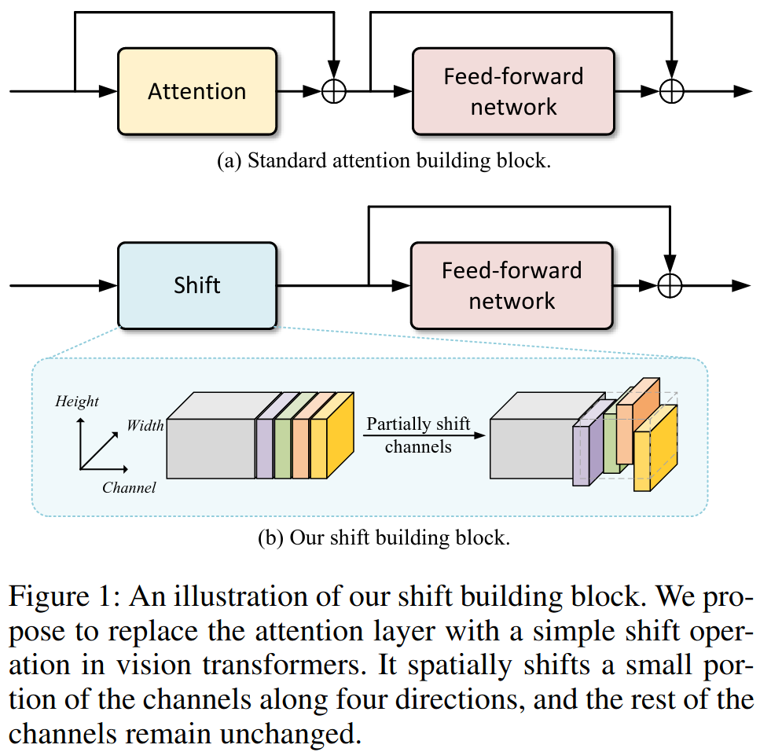
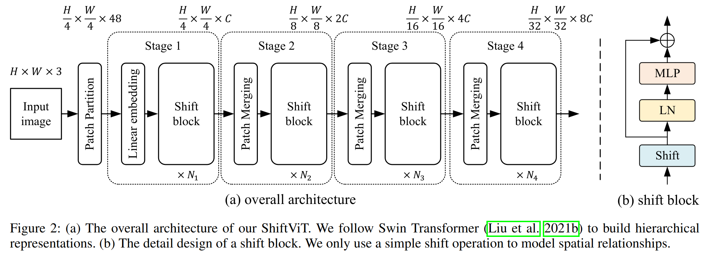

# When Shift Operation Meets Vision Transformer: An Extremely Simple Alternative to Attention Mechanism

## 論文について (掲載ジャーナルなど)
- [Wang, G., Zhao, Y., Tang, C., Luo, C., & Zeng, W. (2022). When Shift Operation Meets Vision Transformer:  An Extremely Simple Alternative to Attention Mechanism. *arXiv preprint arXiv:2201.10801*.](https://arxiv.org/pdf/2201.10801.pdf)

## 概要
- ViTの成功の鍵はAttention機構にないのではないか？という問題定義
- 隣接する特徴間のチャンネルの一部を入れ替えるだけ（算術演算なし、パラメータなし）のShift オペレーションをAttentionの代わりに用いたネットワークでも、SwinTransformerと同等かそれ以上の性能を達成

## 問題設定と解決したこと
- Transformerの成功の鍵はAttention機構にある？

    - 大域的 (global)
        - 狭い領域と広い領域の依存関係を同時に捉えることができる
        - Convolutionは局所特徴しか捉えられない

    - 動的 (dynamic)
        - 2つの場所の特徴の相互作用が、それらの特徴自身から動的に形成される
        - Convolutionは固定のカーネルを使うので静的

- （様々なモデルが提案されてきたことで）上記は「**おそらく違う**」とわかってきた

    - 大域的 (global)？
        - SwinTransformerのように、localな制約を課したほうが精度が良い

    - 動的 (dynamic) ?
        - MLP-Mixerのように、AttentionをMLPで置き換えたものの精度が良い
        - MLPは固定weight＝静的

- Attention機構からShift OP（算術演算なし、パラメータなし）のブロックに置き換えても高精度なモデルを構築できることを確認

    

- Q.シフト操作はCNNでもよく研究されているが、既存の研究は精度がいまいち。なぜこの論文では高精度が達成できたのか？

- A.**DeiTの論文で提案されたViTの学習スキーム**が性能に大きく寄与していることを確認

    - 最適化アルゴリズム：SGD→AdamW
    - 活性化関数：ReLU→GELU
    - 正規化レイヤ：BN→LN
    - 学習スケジュール：90ep→300ep
        - 特に、学習スケジュールが効いている。3%ポイントUP
        - A ConvNet for the 2020sでも、「学習スキームの貢献が大きい」と同じような結論に至っている

## 何をどう使ったのか
- Shift Block
    - 
        1.  チャンネルの$\frac{1}{3}$選択
        2.  選択したチャンネルをさらに4等分
        3.  $\frac{1}{12}C$を空間方向に1ピクセルずつシフト

- Shift ブロックを採用したShiftViTの全体アーキテクチャ
    - 

## 主張の有効性の検証方法
- Vision系の問題設定で精度確認
    - 画像分類
    - 物体検知
    - セマンティックセグメンテーション

- 結果
    - 演算量が同程度になるようにブロックを増やしたモデルだと、SwinTransformerと同等程度の性能
    - 演算量固定で検証すると、単純なブロックを用いると層を深くできる→精度よき

## 批評/備考
- これ本当に既存のモデルが不利にならないように実験してるんかなぁ…
    - ハイパラとかバリデーションとか

- ちゃんと実験
- センスタイムジャパンでの論文読み会の資料
    - [論文読み会「When Shift Operation Meets Vision Transformer: An Extremely Simple Alternative to Attention Mechanism」](https://speakerdeck.com/sensetime_japan/lun-wen-du-mihui-zi-liao-when-shift-operation-meets-vision-transformer-an-extremely-simple-alternative-to-attention-mechanism)

- 実装
    - [microsoft / SPACH](https://github.com/microsoft/SPACH)

## 次に読むべき論文
- DeiT：ViTの標準的な学習パイプラインを設定。以後の研究はこれをフォローしている。
