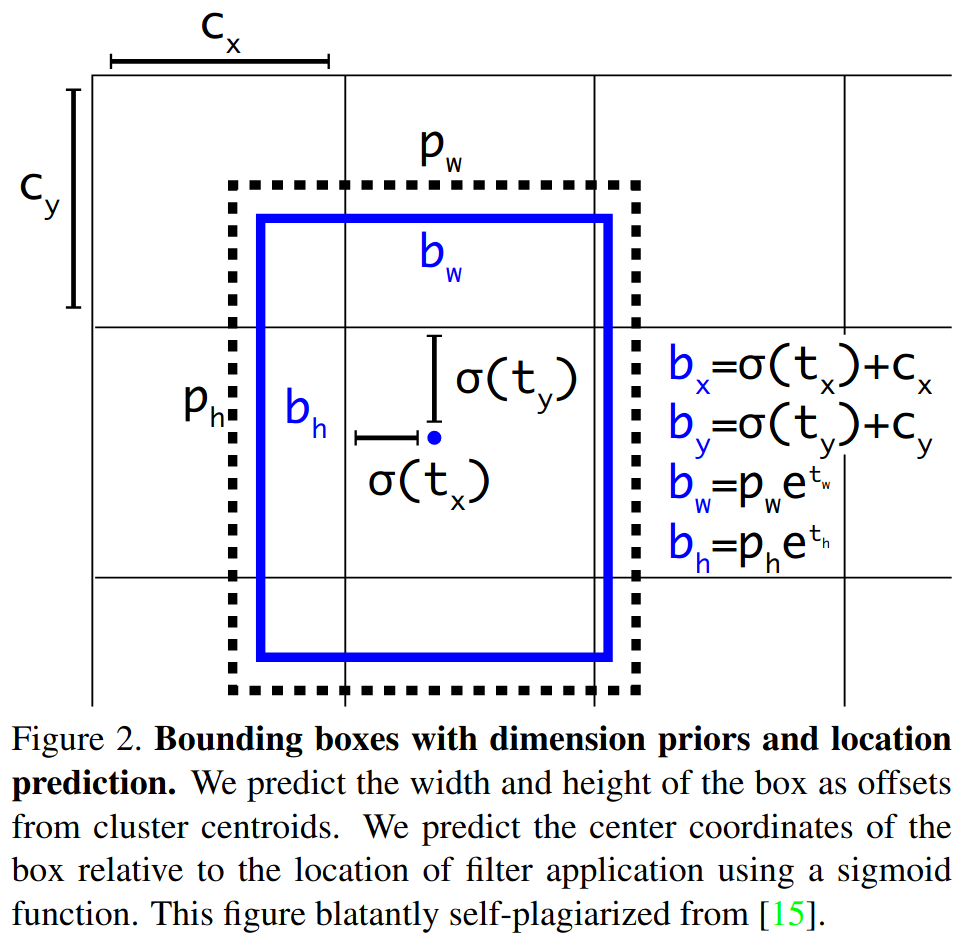
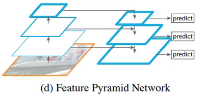

# YOLOv3: An Incremental Improvement

## 論文について (掲載ジャーナルなど)
- [Redmon, J., & Farhadi, A. (2018). Yolov3: An incremental improvement. *arXiv preprint arXiv:1804.02767*.](https://arxiv.org/pdf/1804.02767.pdf)

## 概要
- YOLOをアップデートしたよ
    - デザインのちょっとした変更
    - ネットワークを新規に構築

- SSDと同じ精度で3倍早くなったよ

## 問題設定と解決したこと
- 一般物体認識はいろんなアプリケーションに使えて超重要な研究領域！
    - いろんな人のアイデアを取り入れて、YOLOを改良。高精度＆**高速動作**を実現したよ！

## 何をどう使ったのか
- 学習時に、学習データごとに異なるスケールに対応する3つの3Dテンソルを予測

    - 特徴マップの大きさ$13\times13, 26\times26, 52\times52$（←に奥行き方向の次元があるイメージ）

    - 1つのテンソルを例にとる。大きさが$13\times13$の場合
        - 入力画像を$13\times13$のgrid cellに分割
        - 各grid cellに対する予測結果は$1\times1\times255$のボクセルになる
            - $255=3\times(4+1+80)$
                - 3つのサイズのBB
                    - 各BBには4つのパラメータ
                    - 検出対象の物体かどうかを表すobjectness score
                    - 物体の確信度（MS-COCOなので80クラス）

    - ground truthのboxの中心があるgrid cellの中にあった場合、そのgrid cellによって物体のBBの予測を行う
        - 各grid cell はあらかじめサイズの異なるprior boxを3つ割り当てられている
        - ground truthとサイズが一番近いものを選んでBBの大きさの調整を行う
        - prior boxの大きさは、正解ラベルのBBの幅をk-meansによって9個に分類して得る
            - 9=3スケール$\times$3個

- BBの各パラメータの推論

    - 特徴マップ上の物体の中心$t_x,t_y$とアンカーボックスの縦横の幅$t_w,t_h$をネットワークを用いて推論

    - 画像座標上にBBを持っていく場合（BBの中心$b_x, b_y$、縦横の幅$b_w, b_h$、グリッドの縦横の幅$c_x,c_y$、BBのprior サイズ$p_w, p_h$）
        - $b_x = \sigma(t_x)+c_x$
        - $b_y=\sigma(t_y)+c_y$
        - $b_w=p_w e^{t_w}$
        - $b_h=p_h e^{t_h}$

    - 

- ネットワークアーキテクチャ

    - 75層のCNN
    - FC層を使わないので、入力画像のサイズが任意
    - Residual blockとFPN構造を利用して検出精度を向上
        - FPN構造
            - 画像を畳み込み特徴マップ大を得る→特徴マップ大を畳み込んで特徴マップ中を得る→特徴マップ中を畳み込んで特徴マップ小を得る
            - 特徴マップ小から予測
            - 特徴マップ小をアップサンプリングして特徴マップ中とマージ、特徴マップ小＋中から予測
            - 特徴マップ小＋中をアップサンプリング、特徴マップ大とマージ、特徴マップ小＋中＋大から予測

    - 3つのスケールの予測を出力する
        - Scale 1：小さい物体を検出する用
        - Scale 2：中ぐらいの物体を検出する用
        - Scale 3：大きい物体を検出する用

- クラスの予測

    - Softmax→独立したlogistic分類機
        - 学習時には、クラス予測にBCE lossを使用
        - <u>Softmaxは各ボックスが正確にひとつのクラスを持っているという仮定を課している</u>
            - ↑は重複するラベルがある場合（womanとpersonなど）には合わない

- 損失関数の設計

    - 参考：[YOLOv3 loss function](https://stats.stackexchange.com/questions/380012/yolov3-loss-function)
    - 

## 主張の有効性の検証方法
- 

## 批評
- 文章がフランクすぎる
- YOLO作ってる人、まぁまぁの変人だな
    - Darknetっていうネーミングセンスといい

## 次に読むべき論文
-   [YOLOv4](https://arxiv.org/pdf/2004.10934.pdf)
    -   Bochkovskiy, A., Wang, C. Y., & Liao, H. Y. M. (2020). Yolov4: Optimal speed and accuracy of object detection. *arXiv preprint arXiv:2004.10934*.
