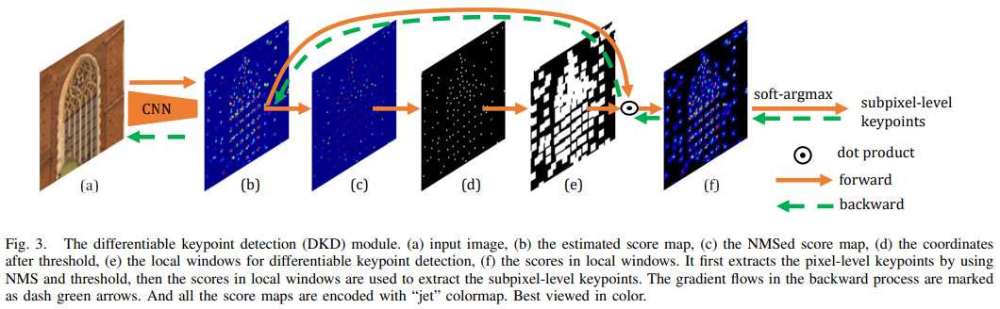

# ALIKE: Accurate and Lightweight Keypoint Detection and Descriptor Extraction

## 論文について (掲載ジャーナルなど)
- [Zhao, X., Wu, X., Miao, J., Chen, W.,  Chen, P. C., & Li, Z. (2022). ALIKE: Accurate and Lightweight  Keypoint Detection and Descriptor Extraction. *IEEE Transactions on Multimedia*.](https://arxiv.org/abs/2112.02906)

## 概要
- 最先端のアプローチと同等の性能かつ推論速度が爆速のキーポイント抽出ニューラルネットワークを提案
    - 商用GPUで $640\times480$ 画像に対して95フレーム/秒で動作可能
- 技術ポイント
    - 正確なサブピクセルキーポイントを出力する、部分的に微分可能なキーポイント検出モジュールを提案
    - サブピクセルキーポイントを直接最適化するための再投影損失を提案し、正則化のための分散性ピーク損失を提案
    - Descriptor をサブピクセル単位で抽出し、安定なニューラル再投影誤差損失を用いて学習

## 問題設定と解決したこと
- 疎なキーポイントやディスクリプタは、効率的な画像マッチングのためのコンパクトな表現
    - 往年の方法は人間のヒューリスティックに基づいて構築されており、複雑な画像では不安定なキーポイントやマッチングしずらいディスクリプタにつながって不安定
- 不安定な表現を改善するために、近年ニューラルネットワークを用いた手法が研究されている
    - キーポイントの検出とディスクリプタの抽出を一つのネットワークでできるようになった
        - [感想]ここらへん全然わからんな。TODO:[12]-[15]あたりの論文ちらっと見るべし
    - キーポイント検出をスコアマップ推定問題として扱う方法が多い
        - ある画素のスコアがそれがキーポイントである確率を表す方法
    - スコアマップを推定する方法は、最後にはスコアマップ上のキーポイントをNMSにより検出する必要がある
        - NMSは微分不可能なので、誤差の逆伝播ができない→**キーポイントを直接最適化することができない**

- 上の問題を解決するために、局所的に微分可能なキーポイント検知手法を提案することで、キーポイントを直接最適化できるようになり、精度向上
- あと既存の方法は動作速度よりもマッチング性能に重点が置かれている
    - 応用考えたら軽量であることが求められるよね（ロボットのSLAM用とか）
    - ネットワークが軽量であることも重視したよ

- 本論文のコントリビューション
    1.  微分可能なキーポイント検出モジュールと、正確で再現性のあるキーポイント学習のための再投影誤差と分散ピークロスを提案
    2.  NRE (Neural Reprojection Error [29]) 損失を用いて、密なディスクリプタマップを学習することにより、安定的にモデルを収束
    3.  効率的なキーポイント検出とディスクリプタ抽出のために、階層的な特徴を集約した軽量なネットワークを設計し、商用GPU上で95 FPSで動作

## 何をどう使ったのか
- スコアマップに基づくキーポイント検出とディスクリプタ抽出のための微分可能キーポイント検知（DKD）を提案
    - NMS (Non-Maximum-Suprression) ベースの手法と比較して、勾配を逆伝播し、サブピクセル精度のキーポイントを生成することが可能
    - 以上により、検出されたキーポイントの位置を直接的に最適化し、精度を高めることができる
    - 
- 軽量なネットワークを設計
    - 
- (A) ネットワークアーキテクチャ
    - 概要は図2をみてね
    - 次の4パートに分けられる
        - (a)画像特徴量エンコーダ
            - 入力画像を特徴マップに符号化
        - (b)特徴集約モジュール
            - それぞれの層から抽出された特徴を集約
            - $1\times1$ 畳み込みとバイリニアアップサンプリングにより、特徴マップの大きさを合わせて単純に連結
        - (c)特徴抽出部
            - 集約した特徴からディスクリプタマップ$D$とスコアマップ$S$をこねこねして作る
        - (d)微分可能キーポイント検出とディスクリプタサンプリング
            - DKDを使って$S$からサブピクセルキーポイント検出
              - 
            - キーポイントのディスクリプタを$D$からサンプル抽出
- (B) 微分可能なキーポイント検出
    - (e)微分可能なキーポイント検出のための局所窓がポイント！
        - (b)スコアマップ→(c)NMSによりキーポイント候補を抽出したマップ→(d)閾値以上のスコアを持つポイントを抽出したマップ→**(e)選ばれた各ポイントを中心とする小さな窓を設定**→(f)bとeの内積をとったスコアマップ→soft-argmaxでサブピクセルレベルのキーポイントを抽出
    - フォーワード
        - NMSと閾値処理を用いて初期キーポイントを決定

    - バックプロパゲーション
        - キーポイントの周囲の局所窓に商店を当てて行われる
            - 局所窓内の操作は微文化のうで、そっらのスコアを最適化することで、サブピクセル精度のキーポイントの位置を調整する
                - [意見] ロスを小さくする方向の値の変動がキーポイントの周囲に染み出す感じ？

            - NMS・閾値処理といった微分不可能なステップをスキップ

- (C) 精確なキーポイントの学習
    - ２つの損失を組み合わせて学習

        1. 再投影損失
            - キーポイントの位置を直接最適化するための損失

        2. 分散性ピーク損失

            - 再投影損失だけのときの課題
                - キーポイントの「粗い」位置と「微細」な位置の最適化がずれることがある！

            - 解決方法：

                - 局所窓内のキーポイントのスコアが「ピーク」になるように制約
                    - キーポイントの位置でのスコア大・その周囲でのスコア小になるように設定

                - 局所窓がちょっとずれてもキーポイントの位置が安定するようになる

    - それぞれの損失の役割を一言でいうと：
        再投影損失はキーポイントを一貫して再現することを保証
        分散ピーク損失はキーポイントの位置でスコアが最大になることを保証
        - 上記の損失関数の最小化によりキーポイントをより正確に特定
- (D) 識別的なディスクリプタの学習
    - 同じキーポイントのディスクリプタは同一であり、異なるキーポイントのディスクリプタは異なるようにしたい（←”識別的”ってこと）
        - よく使われるトリプレット損失だと、キーポイントからサンプリングされたスパースなディスクリプタのみを最適化するので、NG。誤マッチングの温床となる。

    - 解決策：NRE(neural reprojection error)損失[29]を採用
        - 密な再投影確率マップと密なマッチング確率マップとの間のクロスエントロピーの差を最小化する損失
            - 再投影確率マップ：再投影されたキーポイントがある位置に存在する確率を表す（再投影は幾何学的な変換を考慮にいれる）
            - マッチング確率マップ：ソフトマックス正規化した類似性マップ
        - NRE損失を使うことで、**画像全体**を考慮にいれながら、識別的なディスクリプタを得ることができる
- (E) 信頼できるキーポイントの学習
    - 再投影ロスと分散ピークロスに導入によって、正確で再現性のあるキーポイントが手に入る
        - しかし、まだ足りない！

        - **信頼できる**キーポイントをチョイスしたい！
            - →NRE損失にといて、マッチング確率マップに基づく信頼性損失を導入

    - マッチング確率マップとは？
        - （キーポイントの記述子に密な記述子マップを左から作用させた）類似マップを正規化することで得られるマップ
        - キーポイントの信頼性は、確率マップの点pのバイリニアサンプリングにより求められる
            - 直感的には？
                - キーポイントの信頼性は、マッチングの品質を評価する
                    - キーポイントが、信頼性の低い低テクスチャ領域または、パターンが繰り返されている領域にある場合には、その領域の全体的な類似度は低くなる

    - 画像中のすべての有効なキーポイントを考慮して、信頼性損失を定義する
        - 式(21)を参照してね
        - 画像A→画像Bの信頼性損失と画像B→画像Aの信頼性損失の平均をとることで、画像AB間の信頼性損失とする
            - 対称的に考えるよ！

## 主張の有効性の検証方法
- いろいろなデータ・セットで検証
- 計算量くっっそすくない！なのに既存手法とだいたい同じ精度！やったね！
- **提案手法の限界**
  - 提案手法のキーポイントと記述子を用いた画像マッチングでは、以下の2種類の失敗事例あり
    1. 極端な照明変化があるケース
    2. 大きく視点差があるケース
       - どちらもデータの中では最難関の画像マッチング

  - なんで失敗するのか？
    - ALIKEの軽量ネットワークは浅い層しかもたないので、より低レベルの記述子の抽出に制限がかかる→マッチングするポイントの提示能力が犠牲になる
      - 低レベル？←画像の細かい模様（高周波成分）から記述子を抽出できていないってこと？抽出した記述子同士の距離が遠いってこと？

## 批評
- 思ったよりもたくさんの既存のキーポイント検出/ディスクリプタ/Lossの研究が引用されている（ちょっといいとこどりのパッチワーク感があるが）
  - きちんとCVを研究・勉強している人が書いた論文なんだなと思った
  - すごい。好印象。
- 「マッチングの精度が高くてもマッチングのスピードが遅いと応用では使えないだろ！」という問題意識もある
- 提案手法の限界の章を追加しているのが素晴らしい
  - 誠実な態度だとおもう

- バックプロパゲーションするときの窓単位の微分が
  - フォーワードでサブピクセル精度出してるけど、バックプロパゲーションのやりかたで精度向上に寄与してるのか謎
  - なんか細かいところをどっか省略しても、サブピクセル精度に影響しないんじゃ？
    - 自分の理解が浅いせいで変な勘ぐりしてる説は濃厚

## 関連研究
-   ディープラーニングを用いたキーポイント検出の手法は次の3つに大別される
    1.  パッチベースの手法
        -   代表的なやり方は、Matchnet。画像パッチからディスクリプタ抽出→ディスクリプタの類似性を推定しクロスエントロピー損失で学習
        -   ディスクリプタに対して、トリプレットロスを導入する手法TFeatもある
    2.  スコアマップベースの手法
        -   スコアマップとディスクリプタマップを推定。スコアマップはキーポイントの確率を表す。
            -   Tilde, LFNet, MLIFeat, R2D2 など
    3.  ディスクリプタ＆検知手法
        -   キーポイントを画像中の特徴的な位置として認識し、ディスクリプタマップまたは特徴マップの特徴量を計算してスコアマップを生成
            -   D2Net, ASLFeat, D2D など

## 次に読むべき論文
- [NRE loss](https://arxiv.org/abs/2103.07153)
  - 論文のアブストラクトにおける主なポイントは次の通りです：

    1. 絶対カメラ姿勢推定は通常、二つの異なるサブ問題を順次解決することで行われます。最初に2D-3D対応を確立する特徴マッチング問題、次にカメラ姿勢に関する再投影誤差（RE）の合計を最小化するPerspective-n-Point問題です。

    2. 2D-3D対応を生成すると、その情報の多くが失われることが課題となります。この情報損失は、再投影誤差内でロバストな損失関数の選択やハイパーパラメータの調整を通じてできる限り補う必要があります。

    3. この論文では、再投影誤差（RE）の代替としてニューラル再投影誤差（NRE）を導入しています。NREはカメラ姿勢推定問題と特徴学習問題を統合することで、2D-3D対応よりも豊富な情報を活用でき、ロバストな損失関数やそのハイパーパラメータの選択の必要性を排除します。

    4. NREは姿勢推定に適した画像ディスクリプタを学習するための訓練損失として使用できます。

    5. また、カメラ姿勢に対するNRE項の合計を非常に効率的に最小化する粗から細への最適化方法を提案します。

    6. 実験的には、NREが再投影誤差の良い代替品であり、カメラ姿勢推定のロバスト性と精度を大幅に向上させつつ、計算効率とメモリ効率を高く保つことが示されています。

    7. さらに広い観点から見ると、ディープラーニングと3D幾何学を統合するこの新しい方法は、他のコンピュータビジョンアプリケーションにも有用であると考えられます。
