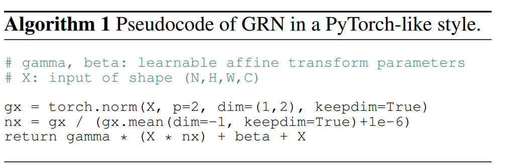
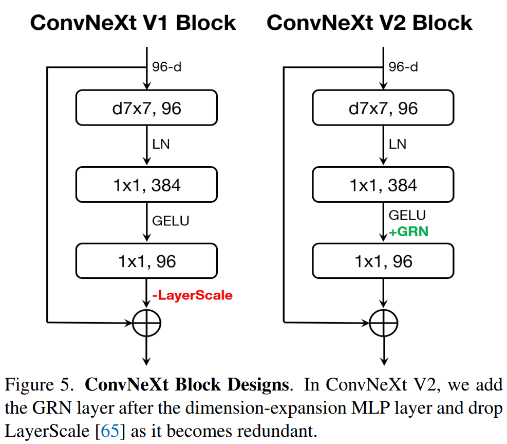

# ConvNeXt V2: Co-designing and Scaling ConvNets with Masked Autoencoders

## 論文について (掲載ジャーナルなど)
- [Sanghyun Woo, Shoubhik Debnath, Ronghang Hu, Xinlei Chen, Zhuang Liu, In So Kweon, Saining Xie](https://arxiv.org/abs/2301.00808)

## 概要
- ConvNeXt に自己教師あり学習手法と新しいレイヤー、Global Response Normalization layer を組み合わせてみたよ
- 結果、ConvNeXtよりもベンチマークでの精度がよくなったよ
- 実装も公開しているよ
    - https://github.com/facebookresearch/ConvNeXt-V2

## 問題設定と解決したこと
- Transformer系の成功によって、自己教師あり手法が流行っている
- ConvNeXtアーキテクチャが純粋な畳み込みモデルでもスケーラブル（データを増やせば増やすほど性能UP）になることが示された

- 仮説：畳み込みモデルにも、Transformerで成功を収めている自己教師ありのエッセンスを入れたら良くなりそう
    - Vitでマスクドオートエンコーダ（MAE）がうまくいってるから、畳み込みモデルにも入れたろ！
- 結果：全然だめ！精度でない！
  - なぜ？
    - MAEがTransformerの時系列処理能力に特化した設計になってるから
      - Transformerでは、計算量の多いエンコーダーが visible patch に集中でき、事前学習コストを削減できる
    - 密なスライディングウィンドウを使用する畳み込みモデルと相性が悪い
  - 先行研究でも、マスクベースの自己教師あり学習による畳み込みモデルの訓練は困難であることが示されてる[43]

- じゃあ、**ConvNeXtモデルにマッチした、マスクベースの自己教師あり学習手法をMAEと同じ枠組みのもとで設計してみよう**
  - 工夫：
    - 疎な畳み込みでConvNeXtを実装
    - TransformerデコーダーをConvNeXtブロックに置き換え、アーキテクチャ全体を畳み込み系に統一して、事前学習の効率を向上
  - 結果：微妙！
    - 学習された特徴は有用だけど、Transformerベースのモデルより性能悪い

- まだまだ精度悪い原因を究明
  - 問題発見
    - ConvNeXtをマスクした入力で直接トレーニングした場合、MLP層で特徴が崩れる
  - 解決策
    - Global Response Normalization layer (GRN)
      - チャンネル間の特徴の競合を強化（←謎。本文をよく読もう）
  - GRNを追加することによってわかった懸念点
    - GRNを追加することが有効に働くケース＝モデルがマスクされたオートエンコーダで事前に訓練されたケース
      - ↑限定的！！
    - **教師あり学習のときと自己教師あり学習のときとで、アーキテクチャを変更した方がいいかもしれん**

## 何をどう使ったのか
- ConvNeXtに２つの工夫を追加
  - Fully Convolutional Masked Autoencoder (FCMAE)
  - Global Response Normalization layer (GRN)

### Fully Convolutional Masked Autoencoder (FCMAE)
- 高いマスキング率で、入力画像をランダムにマスキングし、マスクした部分をコンテクストを考慮してモデルに予測させる方法
  - 
    - スパースコンボリューションベースのConvNeXtエンコーダー+軽量なConvNeXtブロックを用いたデコーダー
      - オートエンコーダのアーキテクチャは非対称
    - エンコーダーは画素のみを処理＋デコーダーは符号化された画素とマスクトークンを用いて画像を再構成
    - ロスはマスクされた領域に対してのみ計算
- この論文での工夫ポイント
  - 高いマスキング率
    - 畳み込みモデルは階層的な設計になっていて、異なる層の間で特徴をダウンサンプリング
    - $32\times 32$ パッチのうち60%をランダムに除去
  - AEの設計
    - エンコーダー設計
      - スパースコンボリューションベースのConvNeXt [15, 27, 28]
        - マスクされた画像はピクセルの2次元スパース配列として表現できるから、スパースコンボリューションを採用するのは自然じゃね？という洞察
    - デコーダー設計
      - プレーンなConvNeXtブロック（1層だけ）
        - エンコーダーが重いので、後半軽くしたかったから
        - 複雑なデコーダー試したけど、あんまりだった
          - ConvNeXtブロックをfine-tuningしたほうが精度高いし、事前学習の時間減らせる
        - アブレーションスタディからデコーダーの次元を512に設定
  - 再構成のターゲット
    - 再構成された画像とターゲット画像間の平均二乗誤差（MSE）
    - 損失はマスクされた部分でのみ計算

### Global Response Normalization layer (GRN)
- 特徴の崩壊
  - FCMAEで事前学習されたConvNeXtベースのモデルのactivationを観察すると特徴が崩壊している現象を発見した
  - 
  - ConvNeXt V1では特徴の多様性がなくなっていることがわかる
  - クロスエントロピー損失を用いることで、クラス判別のための特徴量に集中し、それ以外の特徴量が抑制されているためであると考えられる
- GRNのアルゴリズム
  1. 大域特徴の集約
  2. 特徴の正規化
  3. 特徴のキャリブレーション
  - $$X_i = \gamma*X_i *\mathcal{N}(\mathcal{G}(X)_i)+\beta + X_i$$
    - $\gamma$ と $\beta$ は学習可能なパラメータ
    - $X_i$ は $i$ 番目の特徴マップ
    - $\mathcal{G}(X)_i$ は$i$番目のチャネルの統計値を集約したスカラー
    - $\mathcl{N}$ は、$i$番目のチャネルの他のすべてのチャネルと比較して相対的な重要度を計算する応答正規化関数
  - 疑似アルゴリズム
    - 

- GRNを導入したConvNeXt V2 のブロック
    - 

## 主張の有効性の検証方法
- FCMAEフレームワークを用いたConvNeXt V2を事前学習し、GRNの影響を評価
  - 特徴崩壊の問題を軽減していることを確認
  - 層を超えて特徴の多様性が維持される
    - MAEで事前学習されたViTモデルと同様
- 他の特徴正規化手法との比較
  - GRNとよく使われる下記の正規化層と比較
    - Local Response Nomalization (LRN)
    - Batchd Normalization (BN)
    - Layer Normalization (LN)
  - GRNのみが教師あり学習のベースラインを大幅に上回ることを確認
    - BNはバッチ軸に沿って空間的に正規化するので、マスクされた入力には不向き
      - [意見] ↑結構大事な観察では
- 事前学習/ファインチューニングにおけるGRNの役割の確認
  - 下記のケースで大幅な性能低下を確認
    - GRNをファインチューニングから外すケース
    - ファインチューニング時にのみ初期化したGRNを追加するケース
  - 事前学習とファインチューニングの両方でGRNを維持するほうがベター

- ImageNet-1K, ImageNet-22Kで精度確認
  - ConvNeXt V2 はSOTA
    - [意見] SOTAじゃないと論文としてでてこないんでね

## 批評
- なんでMAEにそんなこだわるの？わからん
  - アーキテクチャが違うんだから、方策が異なっても良くない？
- 特徴の崩壊を抑えられている＝ベターがわからない
  - 結局後段の層で多様な特徴マップ使ってませんみたいなことになってない？

## 次に読むべき論文
- [Jing, L., Zhu, J., & LeCun, Y. (2022). Masked siamese convnets. arXiv preprint arXiv:2206.07700.](https://arxiv.org/abs/2206.07700)
  - マスキングを用いた自己教師あり学習はViTではうまく機能するが、ConvNetsではうまく行かないことを経験的に研究
  - 上記問題を軽減するアーキテクチャ設計を経験的に提案
