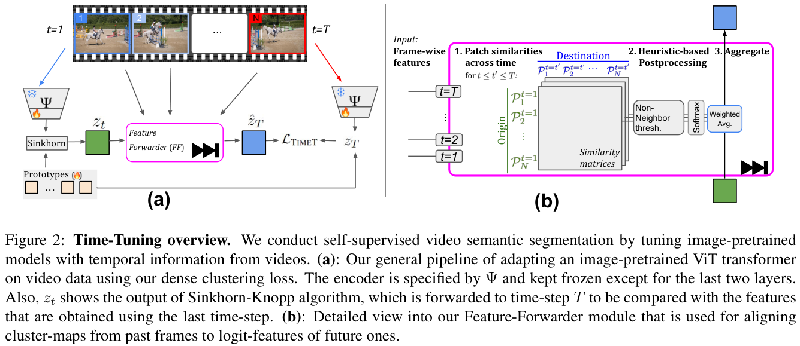
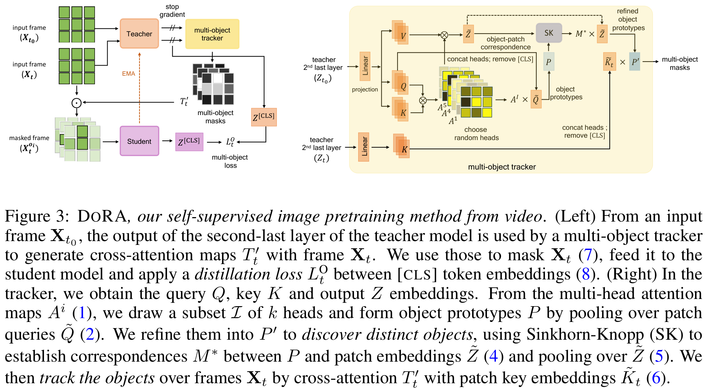

# Vision Foundation Models (with academic compute)

## 論文について (掲載ジャーナルなど)

- [ECCV2024 自己教師あり学習のworkshopでのYuki M. Asano先生の発表資料](https://sslwin.org/assets/slides/ECCV%202024%20SSLWIN%20Yuki%20Asano.pdf)

## 概要

- 「LLMの成功」をコンピュータビジョン分野にももってきたい→Post-pretrainingを取り込もう
- 自己教師あり学習を用いた画像からの特徴量抽出がいいんじゃないか

  - なんで自己教師あり学習？
    - 生データなら大量にあるから
    - ラベルつける作業コストが大変だから
    - ラベルをつけるという事自体に難しさが潜んでいるから
      - たとえば、一言で”家”といってもいろんな種類がある
    - 人の学習の過程の基礎だから
      - 人の学習ではラベルつきデータで学習するわけではないよね

- Asano先生の研究室の自己教師あり学習に関する論文を3つ紹介

  - [NeCo: Improving DINOv2's spatial representations in 19 GPU hours with Patch Neighbor Consistency](https://arxiv.org/pdf/2408.11054)
    - 通称：PaNeCo, NeCo
    - 同じオブジェクトのパッチから抽出された特徴は、同じオブジェクトの別のパッチから抽出された特徴と近くなるように制約をかけよう
  - [Time Does Tell: Self-Supervised Time-Tuning of Dense Image Representations](https://arxiv.org/pdf/2308.11796)
    - 通称：Time-Tuning
    - 動画からViTを自己教師あり学習しよう。時間的な一貫性を保つように制約をかけよう
  - [Is ImageNet worth 1 video? Learning strong image encoders from 1 long unlabelled video](https://arxiv.org/pdf/2310.08584)
    - 通称：Dora
    - たくさんの動画から学習しなくても一本の長い動画からイメージエンコーダーを自己教師あり学習できるんじゃね？→できたわ

- NeCoのいいところ

  - 密なパッチの順序づけ損失はpost-pretrainingにとても適している
  - めちゃ強いDINOやDINOv2Rモデルよりよくできる
  - in-contextセマンティックセグメンテーションでめちゃ改善できた

- Time-Tuningのいいところ

  - 動画は良質な教師信号たり得る
  - フレーム単位の時間不変性ではなく、パッチレベルの不変性が良さげ
  - めちゃ強いDINOモデルを改良できる
  - 教師なしセグメンテーションでもっとも強い改善

- Doraのいいところ

  - ひとつの動画でゼロから強力なエンコーダーをトレーニングできることを示した
  - ImageNetで学習したDINOと同程度のパフォーマンスを発揮できる
  - 学習損失は空間的に密であり、時系列を活用する
  - 複数オブジェクトトラッキングが可能になる
  - 歩行動画は視覚モデルのトレーニングに適していることを示した

- 3つの論文のストーリーのつなげ方
  - 自己教師あり学習に取り組むぞ！
  - 単一の画像から特徴量抽出器を作るぞ！
  - 既存の特徴量抽出器は抽出される特徴量がバラバラになる問題あり
  - 同じオブジェクトのパッチから抽出された特徴量は同じオブジェクトの別のパッチから抽出された特徴量と近くなるように制約かけよう
  - NeCO完成
  - 単一の画像だけじゃなく動画から特徴量を抽出すればいいんじゃね？
  - 時系列方向の一貫性を保ってほしいんだけど…制約をかけよう
  - Time-Tuning完成
  - なんぼ自己教師あり学習っていっても、無限に計算資源やデータが手元にあるわけちゃうし…
  - 筋の良いデータがあれば、特徴量抽出器ってつくれるんちゃうか？やってみよ
  - 高解像度の歩行動画取って、特徴量抽出器つくりました！性能十分
  - Dora完成

## 問題設定と解決したこと

### NeCo

- Patch Neighbor Consistency
  - 目標は、**与えられた入力に対して、同じオブジェクトを表すパッチが類似した特徴を示し、異なるオブジェクトを表すパッチが異なる特徴を示す特徴空間をつくること！**

### Time-Tuning

- 目標は、**動画から抽出される特徴量時系列方向の一貫性を保っていること**
- 下記2つのコンポーネントを使用して、画像のプレトレイン学習から出発して、自己教師あり手法で密な表現を学習する

  - 対応学習：Feature-Forwarderモジュール
    - 事前学習された画像モデルの追跡性能を活用する
    - 時間のことなるフレームにおいて、どの画素が類似の埋め込みを保持し、どの画素が保持すべきでないかを識別する
  - 高密度学習：時空間的に密なクラスタリングモジュール
    - サンプル、場所、時間を横断して教師なしのクラスターを学習する

- 既存手法との差異

  - 既存の画像ベースのアプローチとは異なり、時間次元を明示的にモデル化し、動画の自然なダイナミクスとバリエーションから学習することで、事前学習されたエンコーダーの密な予測性能を向上させる手法を提案
    - 密な特徴ってなんや？
      - 画像の各画素単位の特徴？
      - 画像を細かく細かく特徴量でクラスタリングすること？
    - 時間次元の明示的なモデル化ってなんや？

- メインのアイデア：過去の時間から現在の時間に特徴を変換し、現在観測されている特徴と一致するように強制する

### Dora

- 目標は、**Post-Pretrainingに適した筋のいい動画とは何かを知ること**

## 何をどう使ったのか

### NeCo

- キーとなる要素3つ
  1. Feature Extraction and Alignment
  2. Pairwise Distance Computation
  3. Differentiable Sorting of Distances
     - あるオブジェクトのパッチから抽出した特徴量が、同じオブジェクトの別のパッチから抽出した特徴量と近くなるように「微分付きソート」をする
  4. Training Loss
     - 抽出される特徴量が近くなるように損失を作る

### Time-Tuning

### Dora

## 主張の有効性の検証方法

-

## 批評

-
