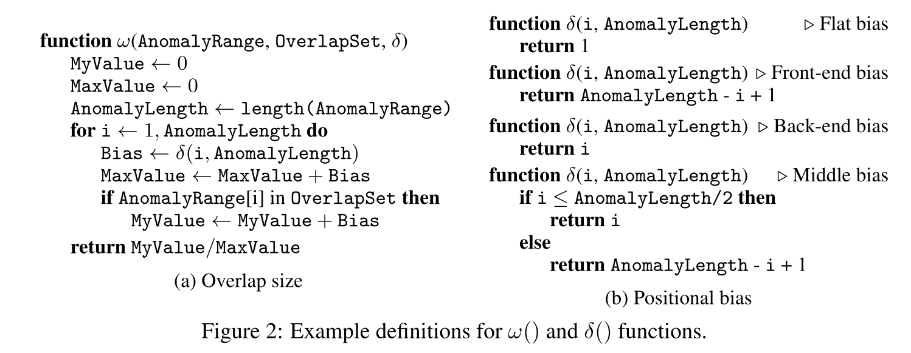

# Precision and Recall for Time Series

## 論文について (掲載ジャーナルなど)

- [Tatbul, N., Lee, T. J., Zdonik, S., Alam, M., & Gottschlich, J. (2018). Precision and recall for time series. _Advances in neural information processing systems_, _31_.](https://proceedings.neurips.cc/paper_files/paper/2018/file/8f468c873a32bb0619eaeb2050ba45d1-Paper.pdf)

## 実装

- [PRTS](https://github.com/CompML/PRTS)
  - 論文著者の実装ではない非公式のものだがとりあえず使える

## 概要

- 異常検知は様々な分野でニーズが高い

  - 古典的な精度評価の方法では、1データ1点としてカウントしPrecisionとRecallを計算する
  - が、上記は現実世界でよく発生する異常とマッチしていない

- 現実世界の多くの異常は、「範囲ベース＝一定期間にわたって発生する」異常
- 本論文では、範囲ベースの異常を分類する時系列分類アルゴリズムの精度評価の新しい方法を提案
  - ドメイン固有の問題に対応できるよう評価方法のカスタマイズも合わせて記載

## 感想

- ドメインごとにどう予測されるのが重要か変わるから、時系列データ向けの柔軟な評価指標つくろうぜという主張
  - 時系列データに実際に起きうる異常にきちんとフォーカスしましょうという観点はすごく共感できる
- ただ提案された評価指標柔軟すぎて、今取り組んでいる課題に合わせて評価指標作りましたと変わらない気がする…
  - それだと、統一的に使えない＝数値がこれこれだったときにこれぐらいはあたっていそうだなという感覚が共有できないから正直使われなさそう
  - パラメータ多すぎるし、どこを重視するかでもころころ変わりそう…
  - 異常のどの区間を予測するのを重視するのか、実際の異常と異常の予測の一対一対応を重視するのかとかバラバラすぎる
- 「モデルの性能を上手に比較したい」というユーザーのニーズに答える書き方にしてほしかったなぁという印象
  - ドメインの例をだして、実際の異常のプロットと予測のプロットを示して、〇〇を重視する場合にはこれぐらいの数値になって、モデルの性能の比較のためにはこういうパラメータがおすすめですよという書き方にしてほしい

### ChatGPTによるまとめ

この論文は、時系列データの分類精度を評価するための新しい数学モデルを提案しています。このモデルは、特に「範囲ベースの異常」に焦点を当てており、ドメイン固有のニーズに対応するためのカスタマイズ可能なフレームワークを提供します。以下に、要点を詳細にまとめます。

1. **どんなもの？**
   - この研究は、時系列データの異常検出と分類の精度を評価するための新しい数学モデルを提案しています。これは、「精度」および「再現率」の指標を範囲ベースの異常を測定できるように拡張し、ドメイン固有のニーズに対応するためのカスタマイズ可能なフレームワークを提供します。
2. **先行研究と比べてどこがすごい？**
   - 既存の評価指標は、ほとんどが点ベースの異常に対して設計されています。しかし、実世界の多くの異常は範囲ベースであり、一連の時間点にわたって発生します。この研究では、この範囲ベースの異常を評価するための新しい数学モデルを提供し、この分野における重要な進歩を達成しています。
3. **技術や手法の重要な部分はどこ？**
   - 提案モデルの主な技術的要素は、「精度」および「再現率」の拡張と、ドメイン固有のニーズに合わせて調整可能なカスタマイズ可能なフレームワークです。これにより、範囲ベースの異常の評価を可能にし、ドメイン固有のニーズに応じて評価方法を調整することができます。
4. **どうやって有効だと検証した？**
   - 著者らは、新しいモデルと既存のモデルとを比較するための詳細な実験を行いました。特に、新しいモデルが従来のモデルとNumentaの最近のスコアリングモデルと比べてどのように機能するかを評価しました。
5. **議論はある？**
   - この研究は新しい評価モデルを提供していますが、その効果の程度や最も効果的な状況などについては、さらなる検証と議論が必要です。また、提案モデルが他の時系列分類アルゴリズムやタスクにどのように適用できるかも重要な研究課題です。
6. **次に読むべき論文は？**
   - この論文の参考文献には、時系列データの異常検出や分類に関するさまざまな論文が含まれています。これらの論文は、提案モデルの理解を深めるために有用です。特に、[11, 17, 18, 21]は範囲ベースの異常に関する研究を行っているため、次に読むべき論文として推奨します。

この論文の「範囲ベースの異常を計測するためのカスタマイズ可能なフレームワーク」は、時間の経過とともに生じる異常を検出するための新しい評価指標を提案しています。従来の異常検出アルゴリズムは、主に「点ベースの異常」を検出するために使用されます。これは、単一の時間点で異常が発生するケースを指します。しかし、実際の問題では、ある期間にわたって異常が発生する「範囲ベースの異常」がしばしば見られます。この論文で提案されているフレームワークは、この範囲ベースの異常を正確に評価するための新しい指標を提供します。これにより、一連の時間点で異常が発生しているかどうかを評価することができます。具体的には、従来の精度（Precision）と再現率（Recall）の指標を拡張し、範囲ベースの異常を考慮に入れるようにしています。さらに、このフレームワークは「カスタマイズ可能」であると述べられています。これは、特定のドメインやタスクに合わせて評価方法を調整できるという意味です。これにより、異なる種類の時系列データや異なる種類の異常に対してもフレームワークを適用することが可能になります。残念ながら、具体的なカスタマイズ方法やフレームワークの詳細な実装については、論文のテキストからは明らかになりません。これらの詳細については、直接論文を参照することをお勧めします。

## 論文読解プロンプト

はい、追加された論文「Precision and Recall for Time Series.pdf」について論文読解プロンプトを実行します。

### 1. 論文のテーマと目的を要約

- **テーマ**: 本論文の主要なテーマは、**時系列データの異常検知アルゴリズムの評価**のための新しい数学的モデルの提案です。
- **目的**: 従来の点ベースの異常に対する評価指標であるPrecisionとRecallを、**期間ベースの異常（range-based anomalies）**を評価できるように拡張すること、そして**ドメイン固有のニーズに合わせてカスタマイズ可能**な評価モデルを提供することです。従来のPrecisionとRecallが時系列データの特性、特に部分的な重複や位置情報を捉えられないという課題を解決することを目的としています。
- **提案手法が必要になるまでのストーリー**: 多くの現実世界の異常は単一点で発生するのではなく、ある期間にわたって発生する期間ベースの異常です。従来のPrecisionとRecallは、文書検索アルゴリズムのために考案された点ベースの評価指標であり、期間ベースの異常を評価する際には、部分的な重複や時間的な位置関係といった重要な要素を捉えきれず、アルゴリズムの性能を適切に評価できないという問題意識があります。特に、ストリーミングデータやリアルタイムシステムの重要性が増す中で、時間的な側面を考慮した正確な異常検知評価の必要性が高まっています。

### 2. 論文のセクション構成を分析

1.  **Introduction**: 異常検知の重要性、現実世界の異常の多くが期間ベースであること、従来のPrecisionとRecallの限界、本論文の貢献（新しいカスタマイズ可能な数学モデルの提案）について述べています。
2.  **Problem motivation and design goals**: 従来のPrecisionとRecallが点ベースの異常には適しているものの、期間ベースの異常には不十分である理由を、部分的な重複や位置情報の重要性などの観点から説明しています。新しいモデルの設計目標として、表現力、柔軟性、拡張性を挙げています。
3.  **Related work**: 時系列分類や異常検知に関する既存の研究、評価指標に関する研究について簡単に触れています。特に、既存の手法が位置的な偏りを考慮していなかったり、調整可能なモデルを提供していない点を指摘しています。Numenta Anomaly Benchmark (NAB)についても言及し、その点ベースの性質と固定された偏りについて述べています。
4.  **Precision and recall for ranges**: 期間ベースのRecall (RecallT) とPrecision (PrecisionT) の新しい定義を、存在、サイズ、位置、カーディナリティの要素を考慮して形式的に提案しています。カスタマイズのための関数（γ(), ω(), δ()）とその役割について説明しています。また、提案する定義が特定条件下で従来の定義を包含することを示しています。
5.  **Experimental study**: 提案モデルの表現力と柔軟性を、古典的なモデルおよびNABのスコアリングモデルと比較する実験結果を示しています。LSTM-ADなどの異常検知アルゴリズムを用いて、複数の実データセットと合成データセットで評価を行っています。位置的な偏りやカーディナリティが評価に与える影響、複数の異常検知器の比較における提案モデルの有効性などを議論しています。計算コストに関する分析も行っています。
6.  **Conclusions and future directions**: 本論文の貢献を再強調し、提案モデルの利点（表現力、柔軟性、拡張性）を述べています。今後の研究の方向性として、実用的なドメインへの適用や新しい期間ベースの機械学習技術の開発を挙げています。
7.  **Acknowledgments**: 謝辞。
8.  **References**: 参考文献リスト。

### 3. 重要なキーワードと概念を抽出

- **異常検知 (Anomaly Detection)**
- **時系列データ (Time Series Data)**
- **点ベースの異常 (Point-based Anomalies)**
- **期間ベースの異常 (Range-based Anomalies)**
- **Precision (精度)**
- **Recall (再現率)**
- **True Positives (TP)**
- **False Positives (FP)**
- **False Negatives (FN)**
- **Fβ-Score**
- **部分的な重複 (Partial Overlaps)**
- **位置情報 (Position)**
- **カーディナリティ (Cardinality)**
- **存在 (Existence)**
- **サイズ (Size)**
- **位置的な偏り関数 (Positional Bias Function) δ()**
- **重複サイズ関数 (Overlap Size Function) ω()**
- **重複カーディナリティ関数 (Overlap Cardinality Function) γ()**
- **RecallT (期間ベースのRecall)**
- **PrecisionT (期間ベースのPrecision)**
- **Numenta Anomaly Benchmark (NAB)**
- **フラットバイアス (Flat Bias)**
- **フロントエンドバイアス (Front-end Bias)**
- **バックエンドバイアス (Back-end Bias)**
- **ミドルバイアス (Middle Bias)**

### 4. 図表の意味と役割を説明

- **Figure 1: Point-based vs. range-based anomalies**: (a) は点ベースの異常におけるPrecisionとRecallの概念を示しており、予測された異常点と実際の異常点を比較しています。(b) は期間ベースの異常における予測された範囲（P1, P2）と実際の範囲（R1, R2, R3）を示しており、部分的な重複や複数の予測範囲と実際の範囲の対応（カーディナリティ）が発生しうることを示しています。これは、従来の点ベースの評価指標が期間ベースの異常には不十分であることを視覚的に説明しています。
- **Figure 2: Example definitions for ω() and δ() functions**: (a) は重複サイズ関数 ω() の例を示しており、予測された範囲と実際の範囲の重複部分の大きさを、位置的な偏り δ() を考慮して評価する方法を示しています。各時点での偏りを累積することで、重複全体の評価値を算出します。(b) は位置的な偏り関数 δ() の4つの例（フラットバイアス、フロントエンドバイアス、バックエンドバイアス、ミドルバイアス）を示しており、アプリケーションの要件に応じて、異常のどの部分をより重要視するかを調整できることを示しています。
- **Figure 3: Our model vs. the classical point-based model**: (a) はRecall、(b) はPrecision、(c) はF1スコアについて、古典的な点ベースのモデルと提案する期間ベースのモデル（様々な位置的バイアス δ() を適用）を、複数のデータセットで比較した結果の棒グラフを示しています。提案モデルが古典的なモデルを包含することを示しつつ、位置的バイアスの違いによって評価結果が変動することを示しており、期間ベースの異常に対する提案モデルの表現力を示しています。
- **Figure 4: Our model vs. the Numenta model**: (a) はNumentaのStandardプロファイル、(b) はReward-Low-FPプロファイル、(c) はReward-Low-FNプロファイルに対応するFβスコアについて、Numentaのスコアリングモデルと提案モデルを比較した棒グラフを示しています。(a) に注目すると、提案モデルがNABの評価傾向を近似できることを示しつつ、Space-Shuttleデータセットの結果の違いから、NABが見落とす可能性のある複雑な要素を捉えられる可能性を示唆しています。
- **Figure 5: Evaluating multiple anomaly detectors**: (a) Sineデータセット、(b) ECGデータセット、(c) NYC-Taxiデータセットにおける、LSTM-AD、Greenhouse、Luminolという3つの異常検知アルゴリズムの予測結果を、古典的なモデル、Numentaモデル、提案モデルで評価した結果の棒グラフを示しています。各モデルが異なる評価傾向を示す場合があることを示しており、提案モデルがアプリケーションの要件（ここでは早期検知と非断片化）をより適切に反映できる可能性を示しています。
- **Figure 6: Cost analysis**: (a) はナイーブな実装、(b) は最適化された実装における、実際の異常範囲数と予測された異常範囲数の増加に対する計算時間のスケーラビリティを示したグラフです。提案モデルのナイーブな実装は古典的なモデルよりも計算コストが高いものの、最適化によってその差を大幅に縮小できることを示しており、提案モデルが実用的な計算コストで実現可能であることを示唆しています。
- **Table 1: Notation**: 論文で使用される記号とその説明をまとめた表です。
- **Table 2: Sensitivity to positional bias**: フロントエンド部分に重複する予測とバックエンド部分に重複する予測に対する、Numenta_Standard、F1_T_Front_Flat、F1_T_Back_Flatの評価値を比較した表です。NABが位置的な偏りを十分に区別できないのに対し、提案モデルは適切なバイアスを設定することで区別できることを示しています。

### 5. 質問リストの各質問を分析（想定）

- **質問1**: 従来のPrecisionとRecallでは、期間ベースの異常を評価する際に具体的にどのような問題がありますか？
  - **意図**: 従来の評価指標の具体的な限界を理解したい。
  - **関連箇所**: Introduction, Problem motivation and design goals.
- **質問2**: 提案されているRecallTとPrecisionTは、従来のPrecisionとRecallとどのように異なりますか？
  - **意図**: 新しい評価指標の基本的な考え方と、古典的な指標からの拡張を理解したい。
  - **関連箇所**: Section 4 (Precision and recall for ranges).
- **質問3**: δ(), ω(), γ() の各関数は、評価においてどのような役割を果たしますか？また、これらをどのようにカスタマイズできますか？
  - **意図**: 提案モデルの柔軟性の源泉となるカスタマイズ関数の意味と利用方法を理解したい。
  - **関連箇所**: Section 4.3 (Customization guidelines and examples), Figure 2.
- **質問4**: 実験結果から、提案モデルはどのような点で従来のモデルやNABモデルよりも優れていると言えますか？
  - **意図**: 提案モデルの具体的な利点と、既存手法に対する優位性を理解したい。
  - **関連箇所**: Section 5 (Experimental study), Figures 3, 4, 5.
- **質問5**: 提案モデルの計算コストはどの程度ですか？実用的な利用は可能ですか？
  - **意図**: 提案モデルの実用性を判断するために、計算効率について知りたい。
  - **関連箇所**: Section 5.5 (Cost analysis), Figure 6.

### 6. 各質問に対する回答を生成

- **質問1**: 従来のPrecisionとRecallでは、期間ベースの異常を評価する際に具体的にどのような問題がありますか？

  - **回答**: 従来のPrecisionとRecallは点ベースの異常を前提としており、期間ベースの異常に対しては以下の点で問題があります:
    - **部分的な重複の扱い**: 予測された異常期間が実際の異常期間と部分的に重複する場合、古典的な指標では完全に一致するか否かのみで評価され、重複の程度が考慮されません。これにより、部分的に正しく検知できている場合でも低い評価となる可能性があります。
    - **位置情報の無視**: 異常期間内のどの部分が正確に予測されたかという位置情報は考慮されません。例えば、異常の始まりを早期に検知することが重要なアプリケーションでも、古典的なRecallではその点が評価されません。
    - **カーディナリティの無視**: 1つの実際の異常期間に対して複数の予測された異常期間が対応する場合や、その逆の場合でも、古典的な指標ではその対応関係の良し悪しを評価できません。例えば、1つの異常を複数の小さな予測に分割してしまう場合でも、古典的な指標ではそれを捉えにくいです。

- **質問2**: 提案されているRecallTとPrecisionTは、従来のPrecisionとRecallとどのように異なりますか？

  - **回答**: 提案されているRecallTとPrecisionTは、従来のPrecisionとRecallを期間ベースの異常に対応できるように拡張したものです:
    - **RecallT**: 実際の各異常期間（Ri）に対して、予測された異常期間（P）との重複の「存在」、重複の「サイズ」、重複の「位置」、そして1つのRiに対していくつの予測期間が対応するかという「カーディナリティ」を考慮して個別のRecallスコアを計算し、それらを平均することで全体のRecallを算出します。特に、存在に対する報酬（ExistenceReward）と重複に基づく報酬（OverlapReward）を重み α で調整できる点が特徴です。
    - **PrecisionT**: 予測された各異常期間（Pi）に対して、実際の異常期間（R）との重複の「サイズ」、「位置」、そして1つのPiに対していくつの実際の期間が対応するかという「カーディナリティ」を考慮して個別のPrecisionスコアを計算し、それらを平均することで全体のPrecisionを算出します。PrecisionTでは、予測の質を重視するため、存在に対する報酬は考慮されません（α=0相当）。
    - どちらの指標も、重複のサイズ、位置、カーディナリティを評価するために、カスタマイズ可能な関数 δ(), ω(), γ() を用いることができます。

- **質問3**: δ(), ω(), γ() の各関数は、評価においてどのような役割を果たしますか？また、これらをどのようにカスタマイズできますか？

  - **回答**:
    - **ω() (重複サイズ関数)**: 予測された異常期間と実際の異常期間の重複部分の大きさを評価します。一般的には、重複が大きいほど高い報酬が得られるように定義されます。カスタマイズは、例えば、重複の各時点の重要度を δ() 関数によって調整した上で、その累積値を評価する形で実現できます。
    - **δ() (位置的な偏り関数)**: 異常期間内のどの位置がより重要かを定義します。例えば、異常の早期発見を重視するならフロントエンドバイアス、異常の終端を正確に捉えることを重視するならバックエンドバイアスといったように、アプリケーションの要件に合わせて選択または定義できます。論文中には、フラット、フロントエンド、バックエンド、ミドルの4つの例が示されています。
    - **γ() (重複カーディナリティ関数)**: 1つの実際の異常期間に対して予測された異常期間の数、または1つの予測された異常期間に対して実際の異常期間の数を考慮します。例えば、1つの実際の異常期間が1つの予測された期間に対応する場合に高い報酬を与え、細かく分割された予測には低い報酬を与えるように定義できます。一般的な例として、重複する範囲の数 x に対して 1/x という関数が考えられます.
  - これらの関数は、アプリケーションの具体的なニーズに合わせて数学的な関数として定義したり、論文で示された例から選択したりすることでカスタマイズできます。重み α も同様に、存在を重視するか、重複の詳細（サイズ、位置、カーディナリティ）を重視するかによって 0 から 1 の間で調整できます。

- **質問4**: 実験結果から、提案モデルはどのような点で従来のモデルやNABモデルよりも優れていると言えますか？

  - **回答**: 実験結果から、提案モデルは以下の点で従来のモデルやNABモデルよりも優れていると言えます:
    - **期間ベースの異常の評価**: 従来の点ベースのモデルでは捉えきれなかった、部分的な重複や位置情報といった期間ベースの異常に特有の要素を評価できます。Figure 3では、同じ異常検知アルゴリズムの結果に対して、異なる位置的バイアスを設定することでRecallとF1スコアが変動することが示されており、提案モデルがこれらの要素に敏感であることを示しています。
    - **柔軟なカスタマイズ**: δ(), ω(), γ() 関数と重み α を調整することで、ドメイン固有の要件に合わせた評価が可能になります。Table 2の実験では、NABモデルが区別できなかった位置的な偏りを持つ予測を、提案モデルが適切に区別できることが示されています。
    - **複数の異常検知器の比較**: Figure 5の実験では、古典的なモデルやNABモデルと異なる評価結果を示す場合があり、提案モデルがアプリケーションの要件（早期検知、非断片化など）を考慮したより詳細な比較を可能にすることを示唆しています。特に、カーディナリティを考慮する γ() 関数の影響で、予測の断片化に対するペナルティが評価に反映される点が古典的なモデルと異なります。
    - **NABモデルの近似と拡張**: Figure 4の実験では、提案モデルがNABのスコアリングモデルの評価傾向を近似できることを示しつつ、NABが見落とす可能性のあるデータセットの特性を捉えられる可能性があることを示しています。

- **質問5**: 提案モデルの計算コストはどの程度ですか？実用的な利用は可能ですか？
  - **回答**: 提案モデルのナイーブな実装は、古典的なモデルよりも計算コストが高いですが、**最適化によって計算コストを大幅に削減できる**ことが示されています。Figure 6bの最適化された結果を見ると、古典的なモデルと比較してまだわずかに計算時間はかかるものの、その差は許容できる範囲にまで縮小しています。論文では、シーケンス間の関係性を利用した比較の削減や、位置的バイアス関数の閉形式での計算などの最適化手法が紹介されています。これらの最適化により、提案モデルは**実用的な計算コストで利用可能である**と考えられます。

### 7. 論文の論理構造の分析

1.  **問題提起**: 多くの現実世界の異常は期間ベースであり、従来の点ベースのPrecisionとRecallでは適切に評価できない。
2.  **動機と設計目標**: 期間ベースの異常評価の必要性を強調し、表現力、柔軟性、拡張性を持つ新しい評価モデルの設計目標を提示。
3.  **関連研究**: 既存の時系列分類・異常検知研究と評価指標研究の限界を指摘し、提案モデルの新規性を強調。特にNABの限界を示す。
4.  **提案モデル**: 期間ベースのRecallTとPrecisionTの数式を、存在、サイズ、位置、カーディナリティの要素を考慮して定義。カスタマイズ関数 δ(), ω(), γ() と重み α の役割を説明。
5.  **実験**: 提案モデルの有効性を、古典的なモデルとNABモデルとの比較、複数の異常検知器の評価を通して実証。位置的バイアスやカーディナリティの影響を示す。計算コスト分析により実用性も示唆。
6.  **結論と今後の展望**: 提案モデルの貢献を再度強調し、今後の研究方向性を示す。

### 8. 参考文献の分析

- **C. C. Aggarwal. Outlier Analysis. Springer, 2013**: 異常分析の基礎的な文献であり、本論文が取り組む異常検知の分野の背景を提供しています。
- **R. Baeza-Yates and B. Ribeiro-Neto. Modern Information Retrieval: The Concepts and Technology behind Search (Second Edition). Addison-Wesley, 2011**: 従来のPrecisionとRecallの起源である情報検索の分野の文献であり、本論文が拡張の基盤とする概念を提供しています。
- **A. Lavin and S. Ahmad. Evaluating Real-Time Anomaly Detection Algorithms - The Numenta Anomaly Benchmark. In IEEE International Conference on Machine Learning and Applications (ICMLA), pages 38–44, 2015**: 本論文が比較対象としているNumenta Anomaly Benchmark (NAB) を提案した論文であり、NABの特性と限界を理解する上で重要です。
- **P. Malhotra, L. Vig, G. Shroff, and P. Agarwal. Long Short Term Memory Networks for Anomaly Detection in Time Series. In European Symposium on Artificial Neural Networks, Computational Intelligence, and Machine Learning (ESANN), pages 89–94, 2015**: 実験で使用されている異常検知アルゴリズムの一つであるLSTM-ADに関する論文です。

これらの参考文献は、異常検知の基礎、評価指標の歴史、比較対象となる既存の評価手法、そして実験に用いられた具体的なアルゴリズムに関する背景情報を提供し、本論文の貢献を明確にする上で役立っています。

### 9. 関連研究との比較

本論文は、既存の時系列異常検知に関する研究は多く存在するものの、それらの評価に用いられる指標が依然として点ベースであり、期間ベースの異常の特性を十分に捉えられていない点を批判的に考察しています。

関連研究として挙げられている、センサーベースの活動認識 や時系列変化点検出 の評価手法も、特定の問題には対応しているものの、位置的な偏りを考慮していなかったり、本論文のような調整可能なモデルを提供していないため、補完的なものと位置づけられています。

特に、LavinとAhmadによるNAB は、時系列異常検知の評価の重要性を指摘している点では共通していますが、点ベースの評価であり、早期検知に固定された偏りを持つため、本論文の提案するより一般的でカスタマイズ可能なモデルとは異なるアプローチであることが強調されています。実験では、提案モデルがNABの評価を近似できることを示しつつ、NABでは捉えられない側面も評価できることが示されています.

### 10. 回答の評価

上記の各ステップにおける回答は、論文の内容に基づいて正確かつ詳細に記述するように努めました。質問リストは想定に基づいたものですが、論文の主要なテーマや提案手法、実験結果に関する重要な側面をカバーするように選定しました。専門用語や複雑な概念については、できる限り分かりやすく説明するように心がけ、必要に応じて論文中の関連箇所を明示的に引用しました。図表についても、その内容と論文における役割を具体的に説明しました。全体として、ユーザーが論文の内容を深く理解し、分析を深めるための情報を提供できたと考えられます。

### 11. 提案手法の全体概要と詳細説明

- **提案手法の全体概要**:

  - 時系列データの期間ベースの異常を評価するための新しいPrecisionとRecallの定義 (RecallTとPrecisionT).
  - 存在、サイズ、位置、カーディナリティという期間ベースの異常評価における重要な要素を考慮.
  - ドメイン固有のニーズに合わせてカスタマイズ可能な関数 (δ(), ω(), γ()) と重み (α) を導入.
  - 従来の点ベースのPrecisionとRecallを包含する拡張モデル.

- **提案手法の詳細説明**:
  - **RecallT (式3, 4)**: 各実際の異常期間 Ri に対して、予測された異常期間 P との重複に基づいてスコアを計算し、全ての Ri について平均を取ります。スコア計算には、異常の存在に対する報酬 (式5) と、重複のサイズ、位置、カーディナリティに基づく重複報酬 (式6) があり、重み α によってこれらの重要度を調整できます。
    - **OverlapReward (式6)** は、重複サイズ関数 ω()、位置的な偏り関数 δ()、カーディナリティ因子 (式7) の積の和として計算されます。カーディナリティ因子は、一つの Ri に対して予測期間が一つだけ重複する場合に最大値 1 を取り、複数重複する場合は γ() 関数によって 0 から 1 の間の値を返します。
    - **ω() 関数 (Figure 2a)** は、Ri と Pj の重複部分のサイズを、各時点の δ() の値を用いて評価します。
    - **δ() 関数 (Figure 2b)** は、異常期間内の位置によって異なる重みを付与します (フラット、フロントエンド、バックエンド、ミドルバイアスなどの例)。
    - **γ() 関数 (例: 1/x)** は、重複する予測範囲の数に応じてカーディナリティに対するペナルティを調整します。
  - **PrecisionT (式8, 9)**: 各予測された異常期間 Pi に対して、実際の異常期間 R との重複に基づいてスコアを計算し、全ての Pi について平均を取ります。PrecisionT では、予測の質を重視するため、存在報酬は考慮されず (α=0)、重複のサイズ、位置、カーディナリティに基づいてスコアが計算されます。カーディナリティ因子は、一つの Pi に対して実際の期間が一つだけ重複する場合に最大値 1 を取り、複数重複する場合は γ() 関数によって調整されます. ω() と δ() 関数はRecallTと同様に使用できますが、PrecisionT 用に異なる定義を用いることも可能です。

### 12. 提案手法の優位な点と批判されるべき点

- **提案手法の優位な点**:

  - **期間ベースの異常を直接的に評価できる**ため、現実世界の多くの異常の特性をより適切に捉えられます。
  - **位置的な偏りやカーディナリティといった重要な要素を評価に組み込める**ため、より意味のある評価が可能になります。
  - **カスタマイズ関数と重みにより、ドメイン固有のニーズや評価基準に柔軟に対応できる**ため、汎用性が高いです。
  - **従来の点ベースのPrecisionとRecallを包含する**ため、既存の評価フレームワークとの親和性があります。
  - 実験結果から、**既存の評価モデル（古典的モデル、NABモデル）よりも詳細で示唆に富む評価が可能である**ことが示されています。
  - 最適化により、**実用的な計算コストで利用できる**ことが示唆されています。

- **提案手法の批判されるべき点**:
  - **導入するパラメータ（α、δ(), ω(), γ()）を適切に設定するには、ドメイン知識やアプリケーションの要件に関する理解が必要**であり、設定が不適切な場合は期待通りの評価が得られない可能性があります。論文中でも、パラメータの適切な設定は今後の課題として言及されています。
  - カスタマイズの自由度が高い反面、**異なるアプリケーションや研究間で評価結果を単純に比較することが難しくなる可能性**があります。共通の評価設定やガイドラインの確立が望まれます。
  - 計算コスト分析では最適化の効果が示されていますが、**非常に大規模なデータセットやリアルタイム処理においては、さらなる計算効率の向上が必要となる可能性**があります。

上記で論文読解プロンプトの各ステップを実行しました。さらに質問があれば、遠慮なくお尋ねください。

## 追加質問

    RecallTとPrecisionTについてもっと詳細に説明して。数式を適切に使って、それぞれを要素ごとに分解して説明して。

提案手法のRecallTとPrecisionTについて、数式を用いて要素ごとに分解し、より詳細に説明します。

### RecallT (Range-based Recall)

Range-based Recall (RecallT) は、**真の異常範囲がどの程度正しく検出されたか**を評価するための指標です。古典的なRecallが点ベースの異常に対して定義されているのに対し、RecallTは時間範囲を持つ異常を扱うために拡張されています。

RecallTは、以下の数式で定義されます:

$RecallT (R,P ) = \frac{\sum_{i=1}^{N_r}RecallT (R_i, P )}{N_r}$

ここで、

- $R = \{R_1, .., R_{N_r}\}$ は真の異常範囲の集合です。
- $P = \{P_1, .., P_{N_p}\}$ は予測された異常範囲の集合です。
- $N_r$ は真の異常範囲の数です。
- $RecallT (R_i, P )$ は、個々の真の異常範囲 $R_i$ に対するRecallスコアです。

個々の真の異常範囲 $R_i$ に対するRecallスコア $RecallT (R_i, P )$ は、**存在報酬 (ExistenceReward)** と **オーバーラップ報酬 (OverlapReward)** の加重和として計算されます:

$RecallT (R_i, P ) = \alpha \times ExistenceReward(R_i, P ) + (1- \alpha) \times OverlapReward(R_i, P )$

ここで、

- $\alpha$ は存在報酬の相対的な重みであり、$0 \leq \alpha \leq 1$ の範囲で調整可能です。$\alpha$ が大きいほど、異常の存在を捉えること自体が重視されます。
- $(1- \alpha)$ はオーバーラップ報酬の相対的な重みであり、重複の大きさ、位置、カーディナリティが重視される度合いを調整します。

#### 1. 存在報酬 (ExistenceReward)

存在報酬は、真の異常範囲 $R_i$ が予測された少なくとも一つの異常範囲 $P_j$ と一点以上重複している場合に与えられます。これは、**異常の存在を捉えたかどうか**を評価するものです:

$ExistenceReward(R_i, P ) =
\begin{cases}
    1, & \text{if } \sum_{j=1}^{N_p} |R_i \cap P_j | \geq 1 \\
    0, & \text{otherwise}
\end{cases}$

ここで、$|R_i \cap P_j |$ は、真の異常範囲 $R_i$ と予測された異常範囲 $P_j$ の重複している点の数です。

#### 2. オーバーラップ報酬 (OverlapReward)

オーバーラップ報酬は、真の異常範囲 $R_i$ と予測された異常範囲 $P$ の間の重複の度合いに基づいて与えられます。これは、**どの程度正確に異常範囲を捉えたか**を評価するものであり、**カーディナリティ (Cardinality)**、**サイズ (Size)**、**位置 (Position)** の側面を考慮します:

$OverlapReward(R_i, P ) = CardinalityFactor(R_i, P ) \times \sum_{j=1}^{N_p} \omega(R_i, R_i \cap P_j , \delta)$

ここで、

- $CardinalityFactor(R_i, P )$ は、カーディナリティ（真の異常範囲 $R_i$ がいくつの予測された異常範囲と重複しているか）を考慮した係数です。一般的に、一つの真の異常範囲が複数の予測された範囲に断片的に検出されるよりも、一つの予測された範囲でまとめて検出される方が好ましいと考えられます。
  - 数式: $CardinalityFactor(R_i, P ) =
    \begin{cases}
        1, & \text{if } R_i \text{ overlaps with at most one } P_j \in P \\
        \gamma(R_i, P ), & \text{otherwise}
    \end{cases}$
  - $\gamma(R_i, P )$ はアプリケーション定義のカーディナリティ関数で、$0 \leq \gamma() \leq 1$ の範囲の値を取り、通常、重複する予測範囲の数が増えるほど小さな値を返します。一般的な例として $\gamma(R_i, P) = 1 / (\text{重複する } P_j \text{ の数})$ などが考えられます。
- $\omega(AnomalyRange, OverlapSet, \delta)$ は、オーバーラップのサイズと位置のバイアスを考慮した関数です。
  - 数式に例示されているように、この関数は、真の異常範囲内の各点 $i$ に対して、位置バイアス関数 $\delta(i, AnomalyLength)$ を適用し、重複している点についてはそのバイアス値を加算し、最終的に考えられる最大のバイアス合計で正規化します。
  - $\delta(i, AnomalyLength)$ は位置バイアス関数で、異常範囲内の位置によって異なる重みを付けます。フラットバイアス（すべての位置で重みが同じ）、フロントエンドバイアス（開始に近いほど重みが大きい）、バックエンドバイアス（終了に近いほど重みが大きい）、ミドルバイアス（中央に近いほど重みが大きい）など、アプリケーションの要件に応じて様々な定義が可能です。
  - $\omega()$と$\delta()$の例

### PrecisionT (Range-based Precision)

Range-based Precision (PrecisionT) は、**予測された異常範囲がどの程度正確か**を評価するための指標です。古典的なPrecisionと同様に、**誤検出 (FP: False Positives) をどれだけ少なくできたか**を測ります。

PrecisionTは、以下の数式で定義されます:

$PrecisionT (R,P ) = \frac{\sum_{i=1}^{N_p} PrecisionT (R, P_i)}{N_p}$

ここで、

- $R = \{R_1, .., R_{N_r}\}$ は真の異常範囲の集合です。
- $P = \{P_1, .., P_{N_p}\}$ は予測された異常範囲の集合です。
- $N_p$ は予測された異常範囲の数です。
- $PrecisionT (R, P_i)$ は、個々の予測された異常範囲 $P_i$ に対するPrecisionスコアです。

個々の予測された異常範囲 $P_i$ に対するPrecisionスコア $PrecisionT (R, P_i)$ は、**オーバーラップ報酬**のみを用いて計算されます。Precisionは予測の質を重視するため、存在報酬のような概念は含まれません（$\alpha = 0$ と考えることができます）:

$PrecisionT (R, P_i) = CardinalityFactor(P_i, R) \times \sum_{j=1}^{N_r} \omega(P_i, P_i \cap R_j , \delta)$

ここで、

- $CardinalityFactor(P_i, R)$ は、カーディナリティを考慮した係数です。この場合は、予測された異常範囲 $P_i$ がいくつの真の異常範囲と重複しているかを考慮します。一つの予測範囲が複数の真の範囲と部分的に重複するよりも、一つの真の範囲と完全に重複する方が好ましいと考えられます。
  - 数式はRecallTと同様の構造を持ちますが、役割が異なります: $CardinalityFactor(P_i, R) =
    \begin{cases}
        1, & \text{if } P_i \text{ overlaps with at most one } R_j \in R \\
        \gamma(P_i, R ), & \text{otherwise}
    \end{cases}$
  - $\gamma(P_i, R )$ はアプリケーション定義のカーディナリティ関数で、$0 \leq \gamma() \leq 1$ の範囲の値を取り、通常、重複する真の範囲の数が増えるほど小さな値を返します。
- $\omega(AnomalyRange, OverlapSet, \delta)$ は、オーバーラップのサイズと位置のバイアスを考慮した関数です。
  - この場合、$AnomalyRange$ は予測された異常範囲 $P_i$、$OverlapSet$ は $P_i \cap R_j$ となります。
  - $\delta$ は位置バイアス関数ですが、PrecisionTにおいては、誤検出は予測範囲内のどこで発生しても同様に悪影響と見なされることが多いため、フラットバイアスが用いられることが多いとされています。

これらの定義により、RecallTとPrecisionTは、時間範囲を持つ異常検出において、古典的な指標よりも詳細で柔軟な評価を可能にします。特に、$\alpha$ の重み付け、カーディナリティ関数 $\gamma()$、オーバーラップサイズ関数 $\omega()$、位置バイアス関数 $\delta()$ を適切に設定することで、**ドメイン固有の要件や優先順位**を評価に反映させることができます. 例えば、早期検出が重要なアプリケーションでは、RecallTの位置バイアス関数にフロントエンドバイアスを設定することで、早期の検出をより高く評価することができます.
